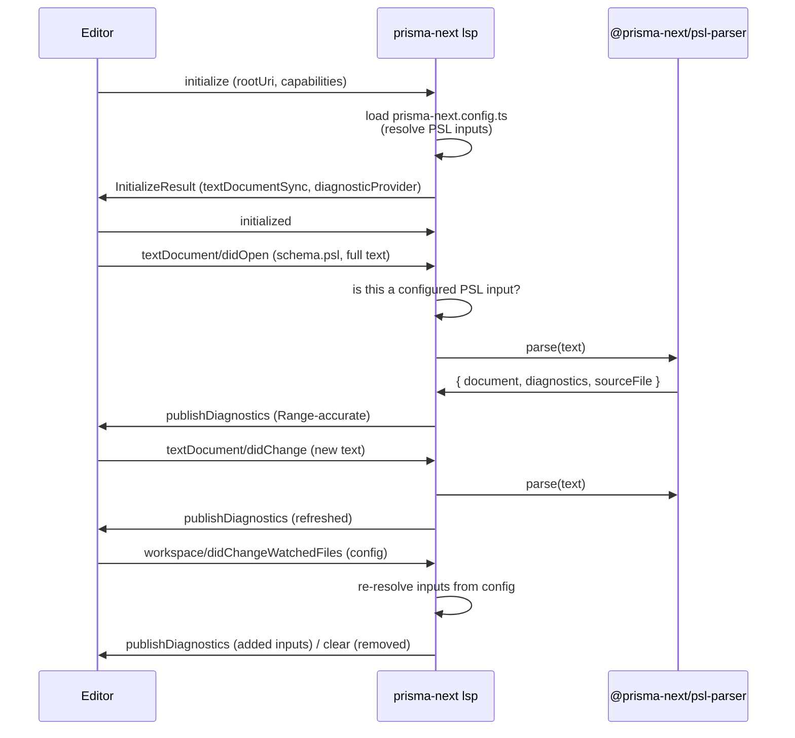

# lsp-scaffold

> Part of the **LSP Support for Prisma Next** effort. This project lays the foundation slice; later projects build hover, completion, and go-to-definition on top of it.

## Purpose

Give Prisma Next users live, in-editor feedback on their PSL as they type — so authoring errors surface at the cursor instead of only at `contract emit` / `format` time. This first project exists to stand up the language-server foundation: a server the editor can launch, point at a project, and receive PSL diagnostics from. Everything richer (hover, completion, navigation) is deferred; the durable thing this project establishes is *that Prisma Next ships a language server at all, reachable through the version-matched CLI*.

## At a glance

The editor spawns the project-local CLI as a language server over stdio, and the server reports PSL parse diagnostics back at the right source positions:

```
node_modules/.bin/prisma-next lsp --stdio
```



The work is mostly *adapter* work, not analysis work. The hard part — turning PSL source into positioned diagnostics — already exists in [`@prisma-next/psl-parser`](../../packages/1-framework/2-authoring/psl-parser): `parse(source)` returns `{ document, diagnostics, sourceFile }`, and each `ParseDiagnostic` already carries a `range: { start: { line, character }, end: { line, character } }` in **exactly** LSP's zero-based line/character coordinate system (see `src/source-file.ts` `Position`/`Range`). So a `ParseDiagnostic` maps to an LSP `Diagnostic` with no coordinate conversion. The novel surface this project adds is the transport, the lifecycle handshake, document sync, config resolution, and the thin mapping layer — not a new diagnostic engine.

The config is the authority for *which* files are the schema, so the server keeps that mapping **live**: it resolves `contract.source.inputs` at `initialize`, watches `prisma-next.config.ts`, and re-resolves when it changes — re-publishing diagnostics for newly-added inputs and clearing them for removed ones. A config edit does not require a server restart.

## Non-goals

- **No language features beyond diagnostics.** No hover, completion, go-to-definition, rename, formatting-over-LSP, code actions, or semantic tokens. Those are later projects in the LSP Support effort.
- **Single project per server.** The server is pointed at one project root via `initialize` and handles exactly that one project. Multi-project / multi-root workspaces are out of scope for the entire LSP Support effort — not deferred, not a later project. The editor launches one project-local server per project; the server never reasons about more than the root it was given.
- **No editor extension / client.** This project ships the server side only (`prisma-next lsp`). VS Code/Zed extension packaging, client-side version resolution, and marketplace publishing are separate work.
- **No diagnostics for non-schema documents.** Documents that are not declared PSL schema inputs in `prisma-next.config.ts` (e.g. `.ts`, `.json`, arbitrary `.psl` files not listed in `contract.source.inputs`) get no diagnostics. The config — not the file extension — decides what the schema is.
- **Open schema inputs only — no eager whole-schema diagnosis, no schema-file watcher.** The server diagnoses a configured PSL input through the open-document channel (`didOpen` / `didChange`); a configured input that is never opened is not diagnosed, and closed `.psl` files are not watched on disk. Rationale: this scaffold does **parse-only** diagnostics, where each input parses independently — so a closed input's content has no bearing on any open file's diagnostics, and a schema-file watcher would be machinery with no user-visible payoff (and would have to navigate LSP open/closed document-ownership to avoid fighting the `didChange` stream). "Eagerly diagnose every configured input" is a separate, nameable capability deferred to a later project; only `prisma-next.config.ts` is watched (it changes *which* files are diagnosed, so it has effect even with zero open inputs).
- **No support for the TypeScript contract source.** When `contract.source.sourceFormat` is `typescript` (or absent / unknown), the server reports nothing. Only `sourceFormat === 'psl'` inputs are parsed. PSL-authoring-in-TS is a different surface, out of scope.
- **No separate `prisma-next-lsp` binary.** The decision is settled: `lsp` is a CLI subcommand, version-matched by construction. A standalone binary is not built.
- **No pull-diagnostics / `textDocument/diagnostic`.** Push (`publishDiagnostics`) only; pull-model diagnostics are a later refinement.

## Place in the larger world

- **Server package (decided):** the server lives in a **new dedicated package** (working name `@prisma-next/language-server`), which `@prisma-next/cli` depends on. The `lsp` subcommand stays a *thin* entry point — `createLspCommand` parses transport flags and wires the connection, then delegates to the server package. This keeps the subcommand-vs-binary decision reversible and keeps the LSP's dependency footprint out of the core CLI surface.
- **CLI host:** `@prisma-next/cli` (`packages/1-framework/3-tooling/cli`), built on `commander`. `lsp` registers as a top-level verb alongside `format` — the cleanest single-verb precedent (`createFormatCommand` in `src/commands/format.ts`, registered in `src/cli.ts`).
- **Diagnostic source (decided):** `@prisma-next/psl-parser` (`packages/1-framework/2-authoring/psl-parser`)'s `parse(source) → { document, diagnostics, sourceFile }` CST path, via its `exports/parser` / `exports/index` barrels. `ParseDiagnostic.range` is LSP-shaped already. `format` consumes the same `parse` entrypoint, so the LSP and the formatter agree on what is a diagnostic. The higher-level `parsePslDocument` AST path is **not** used — it is soon-to-be-removed legacy.
- **Schema-document identification (decided):** the server reads `prisma-next.config.ts` via `@prisma-next/config` (`packages/1-framework/1-core/config`). A document is a schema input iff `contract.source.sourceFormat === 'psl'` **and** its path is one of `contract.source.inputs` (all of them — the schema may span multiple files — resolved against `ContractSourceContext.resolvedInputs`, not just `inputs[0]`). The `sourceFormat` gate mirrors `format`'s own rule: the `ContractSourceProvider` docstring states an absent `sourceFormat` is treated as "not known to be PSL … left untouched."
- **Config watching (decided):** the server registers a file watcher on `prisma-next.config.ts` (via `client/registerCapability` for `workspace/didChangeWatchedFiles`, or static registration in `InitializeResult` if the client supports it) and re-resolves inputs on change. This is the one watched-files surface in scope; no other on-disk paths are watched.
- **LSP protocol library (decided):** `vscode-languageserver` + `vscode-languageserver-textdocument`. These land as third-party dependencies of the new server package (not of `cli`), keeping the JSON-RPC framing/lifecycle machinery off-the-shelf rather than hand-rolled.
- **Architecture / layering:** the new server package sits at the `3-tooling` layer (peer of `cli`, which depends on it). `architecture.config.json` must gain the package's layering entry in the slice that creates it, and `pnpm lint:deps` must stay clean.
- **Industry precedent for the shape:** `deno lsp` (subcommand that *is* the tool, version-matched by construction) is the closest analogue to the decided design.

## Cross-cutting requirements

- **Version-matched by construction.** Because `lsp` is a subcommand of the project-local CLI, the diagnostics a project sees always come from that project's own `@prisma-next` version. No slice may introduce a path that resolves the parser from anywhere other than the running CLI's own dependency tree.
- **Config agreement with the CLI.** The set of files the server treats as schema must equal what `format` / `contract emit` treat as schema for the same project — same config loader, same `sourceFormat === 'psl'` gate, same resolved `inputs`. The server must not invent its own notion of "which file is the schema."
- **Diagnostics agree with `format`/`emit`.** A PSL document that the parser rejects must surface the *same* diagnostics (same code, same message, same range) in the editor as it does on the CLI. The LSP is a presentation layer over the existing parser, never a second opinion.
- **Config stays live.** The server resolves the schema-input set from `prisma-next.config.ts` at `initialize` and reacts to subsequent config changes via `workspace/didChangeWatchedFiles` (a watcher registered on the config path). After a config change: inputs are re-resolved; documents that became inputs gain diagnostics; documents that stopped being inputs (or fell under a non-`psl` `sourceFormat`) have their diagnostics cleared. No restart required. On-disk changes to the config count, whether or not it is open in the editor.
- **Position fidelity end-to-end.** Every diagnostic must land on the correct range in the editor's buffer. Because the parser already emits LSP-shaped zero-based `Range`s, the mapping layer must pass ranges through faithfully (no off-by-one, no re-derivation from offsets).
- **Lifecycle correctness.** The server must implement the `initialize` → `initialized` → … → `shutdown` → `exit` lifecycle such that a conforming client (and the LSP test harness) drives it without protocol errors; an unparseable document yields diagnostics, never a crash or a dropped connection.
- **The CLI stays usable as a CLI.** Registering `lsp` must not regress any existing command, help output, or exit-code behavior. `prisma-next lsp` with no client attached must not hang the test suite (transport is explicit, e.g. `--stdio`).

## Transitional-shape constraints

- **Every merged slice keeps CI green on `main`.** The always-run gates (`pnpm typecheck`, per-package `pnpm lint`) and `pnpm lint:deps` pass after each slice; a new server package, if introduced, lands with its layering entry in the same slice that creates it.
- **`lsp` is registered only once it does something.** No slice merges a `prisma-next lsp` verb that is advertised in help but errors or no-ops when invoked — either the verb is hidden until functional, or the first slice that registers it already answers `initialize`. (Avoids shipping a user-visible command that lies about being ready.)
- **No new third-party dependency lands without the layering + approval gate cleared** (see Place in the larger world). A slice may not smuggle `vscode-languageserver` in as an incidental import.

## Project Definition of Done

_Inherits the team-DoD floor ([`drive/calibration/dod.md`](../../drive/calibration/dod.md)) — not restated here. Project-specific conditions on top:_

- [ ] `prisma-next lsp --stdio` launches a language server that completes the `initialize`/`initialized` handshake and advertises text-document sync + diagnostics capabilities.
- [ ] The server loads `prisma-next.config.ts` and identifies schema documents by `sourceFormat === 'psl'` + membership in the resolved `contract.source.inputs` (all inputs, not just the first); a `.psl` file not listed in `inputs`, and any document under a `typescript`/absent `sourceFormat`, receive no diagnostics.
- [ ] Editing `prisma-next.config.ts` (incl. an on-disk change while it is not open in the editor) re-resolves the input set without a restart: a newly-added input begins receiving diagnostics, and a removed input has its diagnostics cleared.
- [ ] Opening a configured PSL input (`textDocument/didOpen`) publishes diagnostics that match `@prisma-next/psl-parser`'s `parse()` output for that source — same codes, messages, and ranges.
- [ ] Editing an open document (`textDocument/didChange`) re-publishes refreshed diagnostics against the new buffer text; a previously-reported diagnostic that the edit fixes disappears.
- [ ] A document with zero parse diagnostics publishes an empty diagnostic set (clears stale markers), and a syntactically broken document never crashes the server or drops the connection.
- [ ] Closing a document (`textDocument/didClose`) and the `shutdown`/`exit` lifecycle behave per protocol; the process exits cleanly.
- [ ] Existing CLI behavior is unregressed: `--help` lists `lsp`, all prior commands and exit codes are unchanged, and the test suite does not hang on the new verb.
- [ ] The new server package (`@prisma-next/language-server`) exists with its `architecture.config.json` layering entry, `@prisma-next/cli` depends on it, and `pnpm lint:deps` passes.
- [ ] An ADR (or a pointer to one) records the settled "lsp is a version-matched CLI subcommand, one server per project" decision, authored at close-out per the ADR-cadence convention.

## Resolved decisions

_Promoted from open questions by operator review. Binding for this project._

- **Server lives in a new dedicated package** (`@prisma-next/language-server`), imported by `@prisma-next/cli` — not inline in `cli`.
- **`vscode-languageserver` (+ `-textdocument`) is used** for protocol/transport, as dependencies of the new server package.
- **Diagnostic source is `parse` (the CST path) only.** `parsePslDocument` is soon-to-be-removed legacy and must not be referenced.
- **Schema documents are identified from config**, not by file extension: `sourceFormat === 'psl'` **and** path ∈ resolved `contract.source.inputs` (all inputs). The TypeScript contract source is unsupported here.
- **The server reacts to config changes** via a `workspace/didChangeWatchedFiles` watcher on `prisma-next.config.ts`; the input set stays live without a server restart.

_No open questions remain; all design questions are resolved above._

## Contract / Adapter impact

- **Contract-impact:** N/A. This project adds no contract entities and changes no contract kind, serializer, or `contract.json` shape. It is a read-only consumer of `@prisma-next/psl-parser` diagnostics. (Recorded explicitly per `drive/spec/README.md` required-sections convention.)
- **Adapter-impact:** N/A. No `packages/3-targets/**` changes; the server is target-agnostic (PSL text in, diagnostics out).

## References

- Linear Project: [Language Tools Support Prisma Next PSL](https://linear.app/prisma-company/project/language-tools-support-prisma-next-psl-3422a7e44b9c) (team Terminal). Scaffold issue: [TML-2930](https://linear.app/prisma-company/issue/TML-2930/lsp-scaffold-prisma-next-lsp-subcommand-psl-diagnostics).
- Sibling / dependent projects: later work in the same Linear project (hover, completion, navigation) builds on this scaffold.
- ADRs: _to author at close-out — "Prisma Next language server: version-matched CLI subcommand, one server per project."_
- Codebase grounding:
  - `packages/1-framework/2-authoring/psl-parser/src/parse.ts` — `parse(source) → { document, diagnostics, sourceFile }`, `ParseDiagnostic { code, message, range }`.
  - `packages/1-framework/2-authoring/psl-parser/src/source-file.ts` — `Position { line, character }` / `Range` (LSP-shaped, zero-based).
  - `packages/1-framework/2-authoring/psl-parser/src/exports/{parser,index}.ts` — public parser surface (`parse` is the used entrypoint; `parsePslDocument` is legacy, slated for removal).
  - `packages/1-framework/1-core/config/src/contract-source-types.ts` — `ContractSourceProvider { sourceFormat?, inputs?, load }`, `ContractSourceContext.resolvedInputs`; docstring: absent `sourceFormat` → "not known to be PSL … left untouched."
  - `packages/1-framework/3-tooling/cli/src/commands/format.ts` — single-verb command template (`createFormatCommand`); the `sourceFormat === 'psl'` gate the LSP mirrors.
  - `packages/1-framework/3-tooling/cli/src/cli.ts` (~L314-329) — top-level command registration site.
- Design-discussion records: this session — settled (a) one server per project (multi-project workspaces out of scope entirely), (b) version-matched, (c) `lsp` as a CLI subcommand, (d) scaffold scope = initialization + CST-parser diagnostics, (e) server in a new `@prisma-next/language-server` package imported by `cli`, (f) `vscode-languageserver` used for protocol/transport, (g) diagnostic source = `parse` (CST) only, (h) schema documents identified from `prisma-next.config.ts` (`sourceFormat === 'psl'` + all resolved `inputs`), TypeScript source unsupported, (i) the server reacts to config changes via a workspace/didChangeWatchedFiles watcher on prisma-next.config.ts (input set stays live, no restart).
