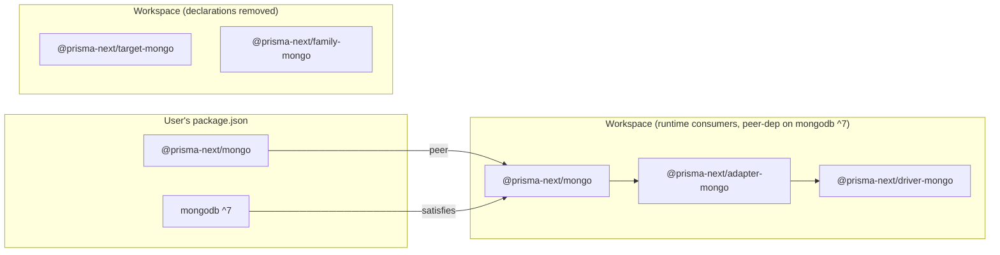

# Summary

Move Prisma Next's mongo packages from the unsupported `mongodb@^6` pin to a single-supported-major peer-dependency posture on `mongodb@^7`. Users declare and install `mongodb` themselves; Prisma Next continues to own the user-facing type surface (the `@prisma-next/mongo/bson` barrel and the typed `mongoClient?` option) for whichever single major Prisma Next is published against.

# Purpose

Unblock users from upgrading the `mongodb` driver in their own application — and free Prisma Next to track new mongo majors on its own cadence — by making the runtime driver an honest, user-controlled peer dependency rather than a hidden bundle pinned to a major (currently `^6`) that we no longer want to support.

# At a glance

A user installing the mongo extension today gets `mongodb@^6` transitively, with no control over the major or minor. After this project, the user picks the install themselves:

```jsonc
// user's package.json (after)
{
  "dependencies": {
    "@prisma-next/mongo": "^X.Y.Z",
    "mongodb": "^7.0.0"
  }
}
```

The user's import surface is unchanged — they continue to import everything through `@prisma-next/mongo/*`, never from `'mongodb'` directly:

```ts
import mongo from '@prisma-next/mongo/runtime';
import { MongoClient, ObjectId, Decimal128 } from '@prisma-next/mongo/bson';

const client = mongo({ contract, url, mongoClient: new MongoClient(url) });
```

Inside the repo, three runtime-consumer packages declare `mongodb` as a peer (`^7.0.0`); two packages that never imported from `'mongodb'` drop the declaration entirely; the workspace catalog moves to `mongodb: ^7.x.y` and `mongodb-memory-server` continues to bundle its matching driver-7 realm:



# Scope

## In scope

- Move `mongodb` from `dependencies` to `peerDependencies` (`^7.0.0`) on the three runtime-consumer packages: `@prisma-next/driver-mongo`, `@prisma-next/adapter-mongo`, `@prisma-next/mongo`.
- Remove the `mongodb` declaration entirely from the two packages that don't import from `'mongodb'` in `src/`: `@prisma-next/target-mongo`, `@prisma-next/family-mongo`.
- Bump the workspace catalog entry from `mongodb: ^6.16.0` to `mongodb: ^7.x.y` (latest minor at land time, inside the supported major).
- Verify the three example apps and the CLI E2E test fixture continue to build + test green against the catalog-bumped v7 driver — they already declare `mongodb: catalog:` and inherit the bump automatically: `examples/mongo-demo`, `examples/retail-store`, `examples/mongo-blog-leaderboard`, and `test/integration/test/fixtures/cli/cli-e2e-test-app`.
- Audit `packages/3-mongo-target/2-mongo-adapter/src/core/command-executor.ts:58` for the v7 semantic change in `collection.drop()` (was-throw → now-`false` on `NamespaceNotFound`); leave behaviour as-is if the audit confirms no caller depended on the throw, otherwise adjust the call site.
- Verify the install graph is coherent post-bump — `pnpm-lock.yaml` resolves a single `mongodb` major (driver-7), eliminating the existing two-major coexistence side effect from `mongodb-memory-server@11.1.0` bundling driver-7 while the catalog pinned `^6`.

## Non-goals

- **Multi-major support of any kind.** No peer-range unions (`^7 || ^8`), no version-detection branches in the runtime, no compatibility shims between mongo majors.
- **Wrapping BSON value classes** (`Binary`, `Decimal128`, `Long`, `ObjectId`, `Timestamp`) with Prisma Next type identities. The `@prisma-next/mongo/bson` barrel continues to re-export `mongodb`'s classes directly.
- **Restructuring the typed `mongoClient?: MongoClient` option** to be structural / version-agnostic. It remains nominally typed against `import('mongodb').MongoClient` in the supported major.
- **Configuring an explicit `batchSize` on cursors** in response to v7's removal of the `1000` default. Deferred — a perf delta (typically *fewer* round-trips, not more, since the driver's removed 1000-doc cap lets the server pack up to 16 MB per `getMore`); not a correctness change.
- **Pre-emptive hardening for v7's `MongoClient.connect()` fail-fast handshake.** Deferred — addressed only if a test breaks.
- **Authoring a public mongo-major upgrade policy / EOL document.** Not in scope here; the version-bump cycle is documented in the project's design notes and will migrate to a durable home (likely an ADR) at project close, only if a durable policy lands.

# Approach

Prisma Next owns the user-facing mongo *type surface* (the `@prisma-next/mongo/bson` barrel and the `MongoBindingOptions.mongoClient?` option) and is published against exactly one `mongodb` major at a time. The runtime driver itself is a peer dependency on the three packages that import from `'mongodb'`: `@prisma-next/driver-mongo` (constructs `MongoClient`, holds `Db`), `@prisma-next/adapter-mongo` (uses `ObjectId`, `MongoServerError`, type-only `Db`/`Document`/`UpdateFilter`), and `@prisma-next/mongo` (re-exports the BSON value classes and accepts a user-supplied `MongoClient`). Users see `mongodb` in their own `package.json` and pick their install themselves; cross-major coexistence is impossible because the peer range is a single major (`^7.0.0`).

Two packages — `@prisma-next/target-mongo` and `@prisma-next/family-mongo` — currently declare `mongodb` in `dependencies` but never `import from 'mongodb'` in `src/`. These declarations are vestigial, almost certainly fallout from an earlier refactor that consolidated runtime usage into the adapter / driver packages. Dropping them in the same change unties users from a constraint that was never load-bearing.

Three call sites change behaviour at the v7 cutover, only one of which needs a code-level decision: `collection.drop()` no longer throws on `NamespaceNotFound` (it returns `false`). The current caller does not special-case the throw, so behaviour shifts silently — the audit step is to confirm no transitive caller relied on the throw and to either leave the call as-is or add an explicit guard. The other two v7 changes that touch our call sites are deferred to the open-questions list (cursor `batchSize` default removal — perf; `MongoClient.connect()` fail-fast — possible test surprise).

The workspace catalog (`pnpm-workspace.yaml`) holds the concrete version inside the supported major (`mongodb: ^7.x.y`) for our own dev/test/CI builds. `mongodb-memory-server@11.1.0` already bundles driver-7 internally, so moving the catalog to `^7` resolves the two-major install-graph side effect that exists today. Future major bumps follow the same shape: extend the surface-area recon to the new major, assess breaking-change impact on the symbols we import and the BSON classes we re-export, bump the peer range and the catalog in a breaking Prisma Next release, document user-visible class-shape changes in migration notes, and users bump in lockstep.

# Project Definition of Done

- [ ] **PDoD1.** The single slice is delivered (one PR landed) or explicitly deferred in `projects/mongo-driver-version-support/deferred.md`.
- [ ] **PDoD2.** Manual-QA coverage across user-observable surfaces; no unresolved 🛑 Blocker findings (specifically: `pnpm install` resolves cleanly in a fresh worktree, the three example apps build and their test suites pass against a memory-server-backed mongod, and the `collection.drop()` audit landed in code).
- [ ] **PDoD3.** Mandatory final retro complete; output landed in canonical / project-context / ADR.
- [ ] **PDoD4.** Long-lived docs migrated into `docs/` if any durable policy / version-bump-cycle ADR is authored during the project.
- [ ] **PDoD5.** Repo-wide references to `projects/mongo-driver-version-support/**` removed or replaced with `docs/` links.
- [ ] **PDoD6.** `projects/mongo-driver-version-support/` deleted.
- [ ] **PDoD7.** Linear ticket [TML-2663](https://linear.app/prisma-company/issue/TML-2663/mongo-driver-is-pinned-to-version-6-cant-support-7-or-8) marked Completed.
- [ ] **PDoD8.** Workspace catalog and all five workspace mongo packages reflect the settled posture: catalog at `mongodb: ^7.x.y`; `peerDependencies: { mongodb: ^7.0.0 }` on `@prisma-next/driver-mongo`, `@prisma-next/adapter-mongo`, `@prisma-next/mongo`; no `mongodb` declaration on `@prisma-next/target-mongo` or `@prisma-next/family-mongo`.
- [ ] **PDoD9.** `pnpm-lock.yaml` resolves a single `mongodb` major (driver-7) — verified by inspecting the lockfile's `mongodb` entries.
- [ ] **PDoD10.** All three example apps (`mongo-demo`, `retail-store`, `mongo-blog-leaderboard`) and the `cli-e2e-test-app` fixture continue to declare `mongodb: catalog:` and continue to build + test green against the catalog-resolved v7 driver.
- [ ] **PDoD11.** The `collection.drop()` audit at `packages/3-mongo-target/2-mongo-adapter/src/core/command-executor.ts:58` is documented in the PR description (either "no caller relied on the throw, behaviour is now a silent no-op on NamespaceNotFound" or the explicit code-level adjustment that was made).
- [ ] **PDoD12.** The PR description includes a user-facing migration-note section that names the `new ObjectId(numericTimestamp)` constructor removal (the one user-visible BSON v7 class-shape change touching `@prisma-next/mongo/bson`); points users at `ObjectId.createFromTime()` as the replacement.

# Functional Requirements

- **FR1.** `@prisma-next/driver-mongo`, `@prisma-next/adapter-mongo`, and `@prisma-next/mongo` declare `mongodb` in `peerDependencies` with the range `^7.0.0`, and do **not** declare `mongodb` in `dependencies`.
- **FR2.** `@prisma-next/target-mongo` and `@prisma-next/family-mongo` declare `mongodb` in neither `dependencies` nor `peerDependencies` — the field is absent from their `package.json` entirely.
- **FR3.** The workspace catalog (`pnpm-workspace.yaml`) pins `mongodb` to a concrete v7 minor (`^7.x.y`, latest at land time).
- **FR4.** The three example apps and the `cli-e2e-test-app` fixture continue to declare `mongodb: catalog:`; the workspace catalog is the source of the `^7.0.0`-compatible constraint.
- **FR5.** The `@prisma-next/mongo/bson` barrel continues to re-export `Binary`, `Decimal128`, `Long`, `MongoClient`, `ObjectId`, `Timestamp` from `'mongodb'` (no shape change; the barrel itself is the user-facing surface commitment).
- **FR6.** `MongoBindingOptions.mongoClient?` remains nominally typed against `import('mongodb').MongoClient` (no shape change; users continue to construct a `MongoClient` from `@prisma-next/mongo/bson` or from `'mongodb'` directly).
- **FR7.** The `collection.drop()` call at `packages/3-mongo-target/2-mongo-adapter/src/core/command-executor.ts:58` is audited against v7's "no-throw on `NamespaceNotFound`" semantic change and either left as-is with a finding recorded, or adjusted with an explicit guard.
- **FR8.** A user-facing migration-note section in the PR description names the `new ObjectId(numericTimestamp)` constructor removal (BSON v7's only class-shape change touching `@prisma-next/mongo/bson`'s re-exports) and points users at `ObjectId.createFromTime()` as the replacement.

# Non-Functional Requirements

- **NFR1.** No new runtime warnings or deprecation notices logged by the v7 driver during the example-app smoke tests.

# Constraints + Assumptions

- **A1.** **BSON v7 class-shape changes are benign for our re-export — researched + confirmed (2026-05-26).** Audit against the `bson` v7.0.0 release notes (<https://github.com/mongodb/js-bson/releases/tag/v7.0.0>) and a repo-wide grep of `new ObjectId(...)` call sites confirmed: the only class-shape change touching our re-exports is the removal of the `new ObjectId(numericTimestamp)` constructor; zero numeric `ObjectId` calls exist in our source or tests. Documented as a user-facing migration-note item (FR8). I12 falsification trigger remains in force for any future major bump.
- **A2.** **`mongodb-memory-server@11.1.0` is compatible with `mongodb@^7`.** The memory-server bundles driver-7 internally already, so the catalog bump aligns the test environment rather than perturbing it.
- **A3.** **No test or runtime path relies on `collection.drop()` throwing on `NamespaceNotFound` — researched + confirmed (2026-05-26).** Audit at `command-executor.ts:57-59` (single call site, return value already discarded) and the call chain through `mongo-runner.ts:121-128` (idempotency check short-circuits drops on missing collections) confirmed no caller and no test depends on the throw. The behavioural shift is benign.
- **A4.** **Node engine floor is satisfied.** The root `package.json` declares `"engines": { "node": ">=24" }`; driver-7's minimum is Node 20.19.0. No engine adjustment is required.
- **A5.** **No public type wrapping is required to keep the user surface stable across major bumps.** Users continue to import BSON classes and `MongoClient` from `@prisma-next/mongo/bson`; the class realm is whichever mongodb major Prisma Next is currently published against.
- **A6.** **Single-supported-major is acceptable for the user base.** Users on the v6 catalog accept a forced upgrade to v7 (and the same model for every future major); a multi-major support window is deliberately not on the table.

# Open Questions

> **Status (2026-05-26): all four open questions researched and resolved during project setup.** Research artifact: [`./research/open-questions.md`](./research/open-questions.md). Verdicts: three ✅ confirms, one ⚠️ framing correction. None reopen the design. Each entry below carries its working position followed by the resolution.

1. **BSON v7 class-shape changes — do any propagate visibly through `@prisma-next/mongo/bson` to user code?** **Working position:** benign — if a meaningful break in `Binary`/`Decimal128`/`Long`/`ObjectId`/`Timestamp` surfaces during implementation, the implementer stops and re-enters design discussion per invariant I12; otherwise we document any user-visible class-shape changes in migration notes. **✅ Resolved — confirms.** BSON v7's only class-shape change touching our re-exports is the removal of the `new ObjectId(numericTimestamp)` constructor (replacement: `ObjectId.createFromTime()`). Zero numeric `ObjectId` calls in our source or tests. Captured as deliverable FR8 (user-migration note in the PR description). The "PN owns the type surface" framing remains intact.
2. **`collection.drop()` no-throw-on-`NamespaceNotFound` (v7 B6) — does any caller in our codebase rely on the throw?** **Working position:** benign — current code at `command-executor.ts:58` does not catch the throw, so the behavioural shift is from "throw → propagate up" to "return `false` → ignored." Audit confirms during implementation; if a caller relied on the throw, a small explicit guard lands in the same PR. **✅ Resolved — confirms.** Single call site (`command-executor.ts:57-59`, return value discarded). Caller chain has no `try`/`catch` reliance and no test asserts on the throw. The migration-runner's idempotency check at `mongo-runner.ts:121-128` already short-circuits drops on missing collections. No code change required beyond awareness; FR7's audit-and-document-finding deliverable still holds.
3. **Cursor `batchSize` default removal (v7 B11) — should we configure an explicit `batchSize` on `aggregate(...)` calls now?** **Working position (corrected):** defer — perf shift, more docs per `getMore` round-trip (typically *fewer* round-trips, not more, since the driver's removed 1000-doc cap lets the server pack up to 16 MB per `getMore`); not a correctness concern. Configure an explicit `batchSize` only if a perf regression surfaces in test / integration after the bump lands. **⚠️ Resolved — defer is correct, framing corrected.** Original rationale "more `getMore` round-trips" was inverted; v7's release notes explicitly state the change *reduces* round-trips. Six cursor sites identified in our source, five returning small result-sets that fit in the initial 101-doc batch (so the v6 default was never engaged on them); the user-facing aggregate path at `driver-mongo/src/mongo-driver.ts:147-151` is more likely to see a perf improvement than a regression.
4. **`MongoClient.connect()` fail-fast handshake (v7 B13) — could any test rely on lazy auth errors?** **Working position:** defer — maintenance item; address only if a test breaks during the bump. **✅ Resolved — confirms.** Every `client.connect()` site in the repo is against credential-free `mongodb-memory-server`. Zero tests exercise auth-failure paths or assert on lazy-vs-eager error timing. Our control-driver wrapper at `driver-mongo/src/exports/control.ts:38-62` already wraps `connect()` in `try`/`catch` and surfaces a structured `errorRuntime`; v7 just shifts *when* the same error fires.

# References

- Linear ticket: [TML-2663](https://linear.app/prisma-company/issue/TML-2663/mongo-driver-is-pinned-to-version-6-cant-support-7-or-8)
- Project design notes: [`./design-notes.md`](./design-notes.md)
- Surface-area recon: [`./research/mongo-surface-area.md`](./research/mongo-surface-area.md)
- mongodb npm driver release notes: <https://github.com/mongodb/node-mongodb-native/releases>
- BSON npm package: <https://github.com/mongodb/js-bson>
