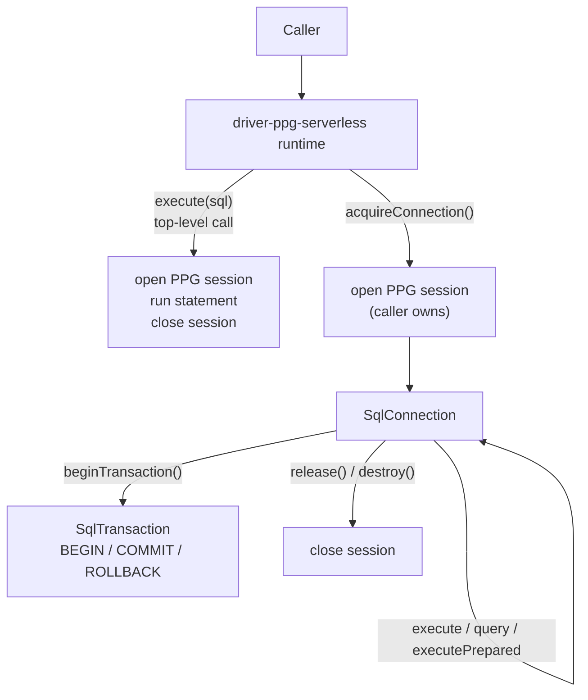

# Design notes: ppg-serverless

> Synthesized design document for the PPG serverless driver + facade. Read this if you want to understand **what the design is**, **what principles it serves**, and **what alternatives were considered and rejected**. Not a chronological log.

## Principles this design serves

- **Driver seam isolation** — All transport differences (WebSocket-via-PPG vs TCP-via-pg, per-session vs pool) terminate at the `SqlDriver` boundary. Layers above (adapter, target pack, family, runtime middleware) cannot tell which driver they're talking to.
- **Facade parity** — `@prisma-next/prisma-postgres-serverless`'s API surface mirrors `@prisma-next/postgres`'s for the data-plane subset. Swapping the facade is a one-line import change for the user; the control plane lives elsewhere by design.
- **Edge-runtime cleanness** — Neither the new driver nor the new facade pulls in `pg`, `pg-cursor`, `pg-pool`, or any Node-only modules. The whole stack must be `fetch` + `WebSocket` only.
- **One transport mode** — All wire traffic goes through a PPG WebSocket session. PPG's stateless HTTP path exists but is not used by this driver; carrying one mental model through the driver is worth more than the marginal latency savings of HTTP for one-shot calls.
- **Reuse the dialect** — `@prisma-next/target-postgres` and `@prisma-next/adapter-postgres` are reused unchanged. PPG speaks the Postgres wire dialect; the SQL we generate is identical.
- **Data plane only** — Control-plane operations (migrations, `dbInit`, `dbVerify`) are not edge-runtime workloads. Users run them through the existing TCP facade from CI / dev machines. This driver doesn't ship a control entrypoint.
- **Local-dev parity** — The integration test path uses `@prisma/dev`'s PPG endpoint (the same programmatic server already used for the TCP driver's tests). Local development and CI run the same wire protocol against PGlite-backed PPG; no live cloud PPG instance is required to develop, test, or demo.

## The model

### Layer placement

The new driver lives at the same layer as `driver-postgres`:

```
packages/3-targets/7-drivers/
├── postgres/         # @prisma-next/driver-postgres (existing, pg-backed)
├── ppg-serverless/   # @prisma-next/driver-ppg-serverless (new)
└── sqlite/
```

Both drivers carry the same descriptor metadata (`familyId: 'sql'`, `targetId: 'postgres'`). The `targetId` is shared deliberately — the target pack does not change, only the wire transport. Downstream stack composition (`adapter-postgres`, `target-postgres`) treats them interchangeably.

The facade lives alongside `@prisma-next/postgres`:

```
packages/3-extensions/
├── postgres/                       # @prisma-next/postgres (existing)
├── prisma-postgres-serverless/     # @prisma-next/prisma-postgres-serverless (new)
└── ...
```

### Driver-internal structure

All wire traffic goes through PPG's WebSocket session API (`client.newSession()`). The driver does not use PPG's stateless HTTP path.

The driver exposes two session-ownership shapes:

- **Per-call sessions** — Top-level `execute()`/`query()`/`executePrepared()` open a session, run the statement, and close. Caller never sees the session.
- **Caller-owned sessions** — `acquireConnection()` opens a session, returns a `SqlConnection` that routes its `execute`/`query` through that session, and exposes `beginTransaction()`. The caller calls `release()` or `destroy(reason)` to close.

Both shapes share the same underlying primitive — they differ in lifetime ownership.



`executePrepared` is structurally identical to `execute` — PPG has no first-class prepare and PPG's own parameterization is safe against SQL injection. The `handle.get/set` cache parameter from the `PreparedExecuteRequest` shape is accepted (so the seam signature is satisfied) but never written. (D2)

### Binding shape

`PpgBinding`:

- `{ kind: 'url'; url: string }` — driver constructs `client(defaultClientConfig(url))` internally and owns its lifecycle.
- `{ kind: 'ppgClient'; client: PpgClient }` — caller passes a pre-constructed PPG client. Driver does not close it.

Symmetrical to `driver-postgres`'s `{ kind: 'url' | 'pgPool' | 'pgClient' }`. The `pgPool` variant has no PPG analogue — PPG handles connection pooling on the server side, so there's only one "shared-client" shape.

### Connection / session lifecycle

A `SqlConnection` returned from `acquireConnection()` owns exactly one PPG session.

- `release()` — closes the session. PPG sessions are cheap; we don't pool them.
- `destroy(reason)` — closes the session and surfaces the reason for observability. Reason is advisory per the `SqlConnection` contract.
- A failed `COMMIT`/`ROLLBACK` does not invalidate the driver itself (unlike the `pgClient`-bound `driver-postgres`, where one socket means one bad transaction can poison the driver). Each session is independent; the driver-level PPG client survives.

### Error normalization

`normalize-error.ts` maps PPG's error hierarchy to prisma-next's SQL error surface:

- `DatabaseError` → `SqlQueryError` (carries `code` → `sqlState`).
- `WebSocketError` → connection-failure error (network category).
- `ValidationError` → invalid-input error (programming bug, not user error).

Same error subclasses as `driver-postgres`, so user error-handling code is portable across drivers.

### Facade composition

`@prisma-next/prisma-postgres-serverless`'s `runtime.ts` is a structural copy of `@prisma-next/postgres`'s `postgres.ts`, with two surgical swaps:

1. `import postgresDriver from '@prisma-next/driver-postgres/runtime'` → `import ppgServerlessDriver from '@prisma-next/driver-ppg-serverless/runtime'`.
2. The binding-construction path (`toRuntimeBinding` / `resolvePostgresBinding`) is replaced with a PPG-binding equivalent that accepts `{ url }` or `{ ppgClient }`.

Everything else — execution-context composition, transaction lifecycle, lazy `getRuntime()`, `prepare()` wrapping, `[Symbol.asyncDispose]` — is identical.

The facade's `./config`, `./contract-builder`, `./family`, `./migration`, and `./target` exports are `export { default } from ...` re-forwards from the same upstream packs the existing `postgres` facade uses. There is no `./control` export (D4) and no `./serverless` export (D3).

### Control plane: deliberately split

Users with both an edge query workload and a migration workflow run two facades against the same database:

| Concern | Facade | Driver | Transport |
| --- | --- | --- | --- |
| Edge queries | `@prisma-next/prisma-postgres-serverless` | `driver-ppg-serverless` | WebSocket |
| Migrations / `dbInit` | `@prisma-next/postgres` | `driver-postgres` | TCP |

Migrations only need to run from CI / dev machines (Node), not from edge runtimes. Forcing PPG's session model onto multi-statement DDL transactions would buy nothing; the TCP path is already proven for that use case.

Locally, `@prisma/dev` exposes both surfaces side-by-side on one PGlite-backed instance: `server.ppg.url` for the serverless facade, `server.database.connectionString` for the TCP facade. Users get the split-facade story end-to-end without any hosted dependencies. (D6)

## Alternatives considered

- **Single facade with a driver-selection option** — i.e., add `driver: 'pg' | 'ppg-serverless'` to `@prisma-next/postgres` instead of shipping a new facade. **Rejected because:** the facade would have to depend on both `pg` and `@prisma/ppg`. Edge runtimes can't load `pg` even if unused (tree-shaking is unreliable across CJS interop boundaries in some bundlers). A separate facade is a cleaner dependency boundary.

- **Mixed transport: HTTP for stateless calls, WebSocket for sessions** — i.e., use PPG's `client.query(...)` (HTTP) for top-level calls and only switch to WebSocket when `acquireConnection` or `transaction` is invoked. **Rejected because:** carrying two transport modes through the driver adds branching (per-call code paths, two sets of error normalization, two timeout policies, two observability surfaces) for a marginal latency win in the one-shot case. The serverless workloads this driver targets are dominated by transactional and multi-statement patterns anyway. One transport mode is one less invariant to maintain. (D1)

- **Reuse `prismaPostgres()` high-level API for the runtime driver** — i.e., skip `client()`/sessions and use `ppg.transaction(cb)` directly. **Rejected because:** prisma-next's `SqlDriver` exposes `beginTransaction()` returning an explicit `SqlTransaction` handle that the caller commits/rolls back. PPG's high-level transaction is a callback-shaped API; mapping it onto an explicit handle would require spawning a deferred promise and inverting control flow. The low-level `client().newSession()` + manual `BEGIN`/`COMMIT` is a direct fit.

- **Implement `executePrepared` with a real PPG-level prepare** — i.e., open a session per prepared statement and issue `PREPARE` / `EXECUTE` manually. **Rejected because:** PPG's WebSocket transport doesn't expose per-statement plan caching as a user-visible surface. The PG server underneath likely caches plans per-session anyway; explicit prepare buys nothing observable and complicates the driver. We collapse `executePrepared` to `execute`. (D2)

- **Add `./serverless` to the facade as a separate per-request shape** — mirroring `@prisma-next/postgres`'s `runtime` vs `serverless` split. **Rejected because:** the per-request shape exists in the `postgres` facade because `pg.Client` and `pg.Pool` have nontrivial Node-side lifecycle (sockets, idle timers) that don't behave well across edge isolate reuse. PPG sessions are cheap and explicit. The base `runtime()` is already per-request-safe; a separate `serverless` export would duplicate code with no semantic difference. The package name itself signals the runtime story. (D3)

- **Ship a control driver alongside the runtime driver** — symmetry with `driver-postgres`. **Rejected because:** migrations and `dbInit` are not edge workloads; they run from CI / developer machines, where the TCP path already works. Building a PPG-backed control surface that nobody will use over the existing TCP control surface is gold-plating. Users run two facades against one database when they need both surfaces. (D4)

- **Forward-only catalog pinning** — i.e., depend on a moving `^1` of `@prisma/ppg`. **Rejected because:** PPG is in Early Access. We pin to an exact version to make breakage visible at upgrade time.

## Resolved decisions

See spec § Resolved decisions for the canonical list. Summary:

- **D1** — All transport is WebSocket-via-PPG-session. No HTTP path.
- **D2** — `executePrepared` collapses to `execute`.
- **D3** — No `./serverless` facade export.
- **D4** — No control driver / no `./control` facade export.
- **D5** — Early Access caveat acknowledged; prisma-next itself is not production-ready, so the EA label doesn't shift overall posture. No special README disclosure needed.
- **D6** — Local-dev integration tests via `@prisma/dev`'s PPG endpoint (`server.ppg.url`). CI runs the integration tests without env gating.

## References

- Project spec: [`./spec.md`](./spec.md)
- Project plan: [`./plan.md`](./plan.md)
- PPG docs: <https://www.prisma.io/docs/postgres/database/serverless-driver>
- `@prisma/ppg` README: <https://www.npmjs.com/package/@prisma/ppg>
- Existing driver reference: [`packages/3-targets/7-drivers/postgres/src/postgres-driver.ts`](../../packages/3-targets/7-drivers/postgres/src/postgres-driver.ts)
- Existing facade reference: [`packages/3-extensions/postgres/src/runtime/postgres.ts`](../../packages/3-extensions/postgres/src/runtime/postgres.ts)
- SQL driver seam: [`packages/2-sql/4-lanes/relational-core/src/ast/driver-types.ts`](../../packages/2-sql/4-lanes/relational-core/src/ast/driver-types.ts)
