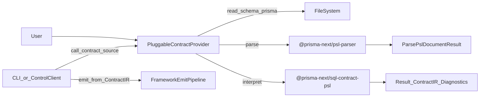

## Summary

Build `@prisma-next/sql-contract-psl`: a SQL-family authoring package that **interprets PSL parser output into SQL `ContractIR`**.

This spec is about the *execution flow* and the *interfaces* we want:

- The **pluggable PSL contract provider** (user-configured `contract.source`) owns **file I/O** and **parsing**.
- `@prisma-next/sql-contract-psl` owns **interpretation** only: PSL AST → SQL `ContractIR` + structured diagnostics.
- The CLI / ControlClient stays **source-agnostic**: it calls `config.contract.source()` and emits from the returned `ContractIR`.

## Target execution flow (end state)

1. User configures a **PSL contract provider** (pluggable `contract.source`) and points it at a PSL schema path (e.g. `./schema.prisma`).
2. The provider:
   - reads PSL text from disk,
   - calls the parser (`@prisma-next/psl-parser`) to obtain **PSL AST + parser diagnostics**,
   - calls the interpreter (`@prisma-next/sql-contract-psl`) to obtain **SQL `ContractIR` + interpreter diagnostics**.
3. The provider returns `Result<ContractIR, Diagnostics>` to the framework.
4. The CLI / ControlClient calls the provider and emits canonical artifacts from the returned IR (no PSL branching).

## Responsibilities and boundaries

### `@prisma-next/sql-contract-psl` (this package)

- **Input**: PSL parser output (`ParsePslDocumentResult` from `@prisma-next/psl-parser`).
  - The parser output contains:
    - a deterministic PSL AST (`ast`) with spans
    - parser diagnostics (`diagnostics`) with spans + `sourceId`
- **Output**: `Result<ContractIR, Diagnostics>`
  - `ContractIR` is the shared/common IR type from `@prisma-next/contract/ir`.
- **Does**
  - Interpret PSL AST into SQL `ContractIR` deterministically.
  - Preserve parser diagnostics and add interpretation diagnostics (stable codes, messages, spans).
  - Produce a `ContractIR` whose *shape* is valid for SQL emission (so emitter validation failures represent bugs/omissions, not routine user errors).
- **Does not**
  - Perform file I/O.
  - Call the parser.
  - Emit canonical artifacts, compute hashes, or format `.d.ts`.
  - Know about config loading, CLI command wiring, or ControlClient concerns.

### Pluggable PSL contract provider (user-configured `contract.source`)

- **Does**
  - File I/O (read PSL text from disk).
  - Parse PSL text into AST (`parsePslDocument({ schema, sourceId })`).
  - Call the interpreter with the parser output.
  - Return `Result<ContractIR, Diagnostics>`.
- **Does not**
  - Emit canonical artifacts (it returns IR only).

### CLI / ControlClient

- **Does**
  - Call `config.contract.source()` and then emit from the returned IR.
- **Does not**
  - Import PSL-specific packages.
  - Branch on source kinds (no PSL vs TS switching).

## Interfaces (expected structure)

### Interpreter API (this spec)

The interpreter’s primary API is **AST-based** (provider invokes parser first):

- **`interpretPslDocumentToSqlContractIR(input)`**
  - **Input**
    - `document`: `ParsePslDocumentResult` from `@prisma-next/psl-parser`
    - optional interpretation options (e.g. default target selection; bounded to what current SQL authoring can represent)
  - **Output**
    - `Result<ContractIR, Diagnostics>`
  - **Contract**
    - includes *all* parser diagnostics in the returned diagnostics payload
    - adds additional interpreter diagnostics for semantic mismatches / unsupported constructs
    - returns `notOk` when interpretation cannot produce a correct `ContractIR`

### Diagnostics contract

The interpreter returns structured diagnostics that are **compatible with provider-based sources**:

- Each diagnostic includes:
  - `code`: stable string code (machine-readable)
  - `message`: human-readable summary
  - `sourceId` (when known; typically PSL path)
  - `span` (when known; from parser AST/diagnostics)
- The `Result.failure.summary` is stable enough to be surfaced directly by CLI/ControlClient renderers.

Notes:
- Parser diagnostics must be preserved without losing span/sourceId fidelity.
- Interpreter diagnostics should prefer pointing at the relevant AST span (model/field/attribute) rather than the file root.

### IR boundary (shared/common)

The SQL `ContractIR` produced here is the same `ContractIR` type used by TS-first authoring and emission:

- **Source of truth type**: `@prisma-next/contract/ir` (`ContractIR`)
- **SQL-specific structure expectations** (non-exhaustive; matches existing SQL emission validators):
  - `targetFamily: "sql"`
  - `target: <sql-target-id>` (e.g. `"postgres"`)
  - `storage.tables` with columns including `codecId`, `nativeType`, `nullable`, and optional defaults/typeRefs
  - `models` mapping application model names to table + column mappings
  - `relations` populated (or empty objects) according to existing SQL contract semantics

## Determinism guarantees

- Repeated interpretation of the same PSL input must produce equivalent `ContractIR` (stable ordering and identities).
- Where PSL permits multiple equivalent encodings, the interpreter must choose one canonical representation (e.g. ordering of emitted arrays / constraint naming strategy).

## Acceptance criteria

### End-to-end proof (required)

Maintain or add an integration test that demonstrates the full flow:

- read PSL file from disk (provider)
- parse to AST (`@prisma-next/psl-parser`)
- interpret AST to SQL `ContractIR` (`@prisma-next/sql-contract-psl`)
- emit `contract.json` + `contract.d.ts` (framework emit pipeline)

### Package boundaries

- `@prisma-next/sql-contract-ts` no longer depends on `@prisma-next/psl-parser` and contains no PSL interpretation code.
- `@prisma-next/sql-contract-psl` depends on `@prisma-next/psl-parser` and contains the PSL interpretation implementation + tests.

### Diagnostics behavior

- Unsupported PSL constructs return `notOk` with:
  - a stable summary,
  - at least one diagnostic with stable `code`, human message, and span when available.

## References

- `projects/psl-contract-authoring/specs/pluggable-contract-sources.spec.md`
- `projects/psl-contract-authoring/specs/contract-psl-parser.spec.md`
- ADR: `docs/architecture docs/adrs/ADR 163 - Provider-invoked source normalization packages.md`

