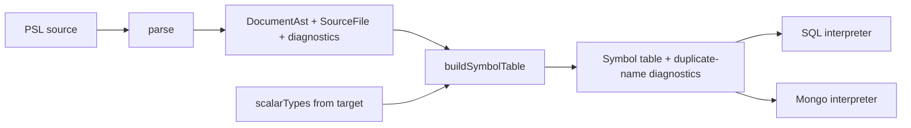

# Summary

Retire the legacy line-based PSL parser (`parsePslDocument`) in favour of the fault-tolerant CST parser (`parse`), and introduce a `buildSymbolTable` function — co-located in `@prisma-next/psl-parser` — that turns the CST `DocumentAst` into a resolved, scope-aware symbol table. Interpreters consume the symbol table instead of the legacy AST, reaching feature parity on the diagnostics they emit today.

# Context

## At a glance

`@prisma-next/psl-parser` ships two parsers right now. The old one, `parsePslDocument`, is a line-oriented parser that emits a fully-resolved `PslDocumentAst`: namespaces keyed as `entries[kind][name]`, models/composite-types/extension-blocks pre-bucketed, qualified type references split into `typeName`/`typeNamespaceId`/`typeContractSpaceId`. The SQL and Mongo interpreters walk that resolved shape directly (`input.document.ast.namespaces`, `…compositeTypes`, `…types.declarations`, `namespacePslExtensionBlocks(ns)`). The new one, `parse`, is a fault-tolerant CST parser (`parse(source): { document: DocumentAst; diagnostics; sourceFile }`) that never throws — but its `DocumentAst` is a thin red-tree facade: declarations are an undifferentiated stream, names are not deduplicated, type annotations are unresolved `QualifiedNameAst` nodes, and there is no scalar-vs-alias distinction.

We want to delete `parsePslDocument`. But the interpreters lean on the resolved structure the legacy AST gave them, and porting each interpreter to walk a raw CST would scatter the same name-resolution and bucketing logic across both of them. Instead we insert one resolution layer between the CST and the interpreters: a **symbol table**.

_Illustrative — the consumer-facing shape; exact field names and the resolution of nested scopes are the implementer's to finalise within the constraints in Requirements:_

```ts
const { document, diagnostics, sourceFile } = parse(source);
const symbols = buildSymbolTable({
  document,
  sourceFile,
  scalarTypes: ['String', 'Int', 'Boolean', /* … from the target */],
});
// `diagnostics` (from parse) and `symbols.diagnostics` (duplicate-name findings) are two
// separate lists; the caller surfaces both.
// symbols.topLevel: namespaces, scalars, type aliases, blocks, models, types — discriminated by `kind`.
// Each symbol carries `.node` — the CST AST node it was built from.
```

## Problem

There are two parsers in one package and the codebase straddles them. The legacy `parsePslDocument` is what every production caller (the SQL and Mongo `provider.ts`), every interpreter, and the printer's round-trip tests still call. The CST `parse` exists and is fault-tolerant, but nothing downstream consumes it yet.

The legacy parser does double duty: it parses **and** resolves. Its output `PslDocumentAst` is not a syntax tree — it is a semantic model. Namespaces expose `entries[kind][name]` keyed maps and derived `models`/`compositeTypes` getters; fields carry split qualified-type metadata; `types { … }` declarations are pre-collected; extension blocks are read through descriptor-driven parsing into typed `PslExtensionBlock` parameter nodes. The interpreters were written against that semantic model.

The CST parser deliberately stops at syntax. Its `DocumentAst.declarations()` yields models, composite types, namespaces, types-blocks, and generic blocks as an undifferentiated stream with no de-duplication; `FieldDeclarationAst.typeAnnotation()` returns an unresolved `TypeAnnotationAst` whose `name()` is a `QualifiedNameAst` (with `space()`/`namespace()`/`identifier()`/`isOverQualified()` accessors); a `NamedTypeDeclarationAst` does not know whether its base type is a scalar or another alias. Pointing the interpreters straight at this tree would force each one to re-derive name buckets, duplicate detection, and scalar-vs-alias classification independently — duplicated, and a parity risk.

The legacy AST is also consumed by the printer (introspection: `printPslFromAst(ast)` is fed by `sqlSchemaIrToPslAst`, not by the parser). That consumer keeps the legacy `PslDocumentAst` **type** alive; only the legacy `parsePslDocument` **function** is being removed.

## Approach

Add `buildSymbolTable` alongside `parse` in `@prisma-next/psl-parser`. It is a pure, fault-tolerant resolution pass over the CST: it never throws, and it surfaces every problem as a diagnostic. It takes the CST `DocumentAst`, the `SourceFile` (for span/position resolution), and a required `scalarTypes` list — the set of scalar type names, which each target supplies independently (the package ships no default). It returns the symbol table plus its own diagnostics array — the duplicate-name findings only — kept as a separate list from the diagnostics that parse returns; the caller surfaces both.

The symbol table is the resolved, keyed, scope-aware model the interpreters need — the role the legacy `PslDocumentAst` played, rebuilt on top of the CST:



The table's scopes mirror PSL's nesting. Top-level holds namespaces, scalars, type aliases, blocks, models, and composite types, each entry discriminated by a `kind` field. Models, composite types, and generic blocks that appear inside a `namespace { … }` block are nested under that namespace, keyed by name and discriminated by `kind`. Fields are nested under their owning block (model or composite type). Within any one scope, two declarations sharing a name produce a dedicated duplicate-name diagnostic; the symbol table keeps the first declaration (first-wins) and flags each later one, recording a deterministic single entry per name rather than throwing. At the top level and inside a namespace, a same-name collision is reported regardless of kind.

The `scalarTypes` input resolves the one classification the CST cannot make on its own: a `types { Foo = <base> }` declaration whose base type is a known scalar is a **scalar** binding; otherwise it is a **type alias**. This is why the input is required and target-supplied.

Every symbol holds a reference to the CST AST node it was built from (e.g. a model symbol references its `ModelDeclarationAst`, a field symbol its `FieldDeclarationAst`), so interpreters can reach back to spans, attributes, and raw type annotations during lowering.

Once the symbol table lands and both interpreters consume it, `parsePslDocument` and its dead resolution machinery are deleted. The legacy `PslDocumentAst` **types** stay (introspection/printer still depend on them); the legacy **parser** does not.

# Requirements

## Functional Requirements

### Symbol table construction

- **FR1.** `@prisma-next/psl-parser` exports a `buildSymbolTable` function co-located with `parse` (same package, alongside the parser module). It accepts an options object with required `document` (the CST `DocumentAst`), required `sourceFile` (the `SourceFile` from `parse`), and required `scalarTypes` (a list of scalar type names). There is no default `scalarTypes` in the package — the caller (each target) supplies it.
- **FR2.** `buildSymbolTable` is fault-tolerant: it never throws on any input, including malformed or partially-recovered CSTs. Every problem it detects is reported as a diagnostic in its result.
- **FR3.** `buildSymbolTable` emits **only its own** diagnostics (the duplicate-name findings of FR9). It does not re-accept or merge the parser's diagnostics. The caller holds two lists — the `diagnostics` returned by `parse` and the `diagnostics` returned by `buildSymbolTable` — and surfaces them together. The symbol-table result therefore exposes a diagnostics collection containing solely symbol-table diagnostics.

### Symbol table shape

- **FR4.** Top-level symbols cover: namespaces; scalars (the `types { … }` bindings whose base type is in `scalarTypes`); type aliases (the remaining `types { … }` bindings); generic/extension blocks; models; and composite types. Each top-level symbol is discriminated by a `kind` property.
- **FR5.** Models, composite types, and generic blocks declared inside a `namespace { … }` block are nested under that namespace symbol, keyed by name, each discriminated by a `kind` property. (Per the CST grammar, `types { … }` blocks and nested `namespace` blocks are not namespace members.)
- **FR6.** Fields are nested under their owning block symbol (model or composite type), keyed by field name.
- **FR7.** Every symbol carries a reference to the CST AST node it was built from (e.g. `ModelDeclarationAst`, `CompositeTypeDeclarationAst`, `GenericBlockDeclarationAst`, `NamedTypeDeclarationAst`, `FieldDeclarationAst`, `NamespaceDeclarationAst`). The reference is the access path interpreters use to reach spans, attributes, and unresolved type annotations.
- **FR8.** A `types { … }` binding is classified **scalar** when its declared base type name appears in `scalarTypes`, and **type alias** otherwise. This is the sole classification that depends on the `scalarTypes` input.

### Duplicate detection

- **FR9.** Two or more declarations sharing a name in the same scope produce a duplicate-name diagnostic, and the symbol table resolves the name to a single deterministic entry on a **first-wins** basis (the first declaration is kept; each later same-name declaration is flagged). The tie-break and flag-the-later behaviour mirror the one duplicate precedent the legacy parser had — `PSL_EXTENSION_DUPLICATE_PARAMETER`, "first occurrence wins". `buildSymbolTable` introduces a **dedicated duplicate-name diagnostic code** for declarations (the legacy parser had none: same-name declarations silently overwrote in the `entries[kind][name]` map, and a same-namespace duplicate model surfaced only as a thrown `Error` deep in the SQL interpreter — never a clean diagnostic). The new code replaces both the silent overwrite and that thrown invariant.
- **FR9a.** "Same scope" is: (a) the document top level; (b) the body of one `namespace { … }` block; and (c) the body of one block (model or composite type), for its fields. **At the top level and within a namespace, a same-name collision is reported regardless of `kind`** — a top-level `model User` and a top-level composite `type User` collide, as do a `model A` and a generic block `policy A` in the same scope. (This is stricter than the legacy `entries[kind][name]` rule, which keyed per-kind and so let same-name different-kind declarations coexist; the symbol table deliberately tightens this to a single name-per-scope rule.)

### Interpreter migration

- **FR10.** The SQL interpreter (`@prisma-next/sql-contract-psl`) consumes the symbol table as its input in place of the legacy `ParsePslDocumentResult`. Its `provider.ts` calls `parse` + `buildSymbolTable` instead of `parsePslDocument`.
- **FR11.** The Mongo interpreter (`@prisma-next/mongo-contract-psl`) consumes the symbol table as its input in place of the legacy `ParsePslDocumentResult`. Its `provider.ts` calls `parse` + `buildSymbolTable` instead of `parsePslDocument`.
- **FR12.** After migration, the set of diagnostics each interpreter emits for a given schema reaches **feature parity** with today's behaviour: every condition that produces a diagnostic today still produces one, and no new spurious diagnostics appear. Exact diagnostic **wording** and **span** may change where that makes the implementation simpler, provided the replacement remains accurate and understandable to the reader. Diagnostic **codes** that downstream consumers or tests key on are preserved unless a code's meaning genuinely no longer applies.

### Removal

- **FR13.** `parsePslDocument` is removed from `@prisma-next/psl-parser` — the function, its `src/parser.ts` implementation, its export from `src/exports/index.ts` and `src/exports/parser.ts`, and the resolution-only machinery that exists solely to feed it. No production code path calls `parsePslDocument` after this project.
- **FR14.** The legacy `PslDocumentAst` AST **types** (and the `printPslFromAst` printer path that consumes them via introspection) remain intact. Only the legacy parser entry point and its private resolution code are removed.
- **FR15.** Tests that call `parsePslDocument` are migrated to `parse` + `buildSymbolTable`, or retired where they tested resolution behaviour now covered by symbol-table tests. The **printer is not touched**: the legacy `PslDocumentAst` types stay alive for its sake, and `printPslFromAst` keeps consuming them. The printer's round-trip tests that currently parse source with `parsePslDocument` are the one exception that must construct a legacy `PslDocumentAst` another way (e.g. via the introspection AST builder `sqlSchemaIrToPslAst`, or a fixture AST) rather than through the removed parser — they must **not** be rewritten to round-trip through `parse`+`buildSymbolTable`, since the printer's contract is with the legacy AST. Only the legacy parser entry point is removed; the printer's input shape is unchanged.

## Non-Functional Requirements

- **NFR1.** `buildSymbolTable` is a pure function of its inputs (no I/O, no global state); the package continues to perform no file I/O.
- **NFR2.** Symbol-table construction is deterministic: the same CST + `scalarTypes` yields the same table and the same diagnostic ordering on every run.
- **NFR3.** The change holds the repo's type-safety bar: no `any`, no bare `as` in production code (use `blindCast`/`castAs`), no new lint suppressions, and `pnpm lint:deps` stays green (the symbol table introduces no new cross-domain dependency from `@prisma-next/psl-parser`).
- **NFR4.** Tests are written before the implementation they cover (symbol-table tests precede `buildSymbolTable`; migrated interpreter tests precede the interpreter changes).

## Non-goals

- Removing or rewriting the legacy `PslDocumentAst` types or the `printPslFromAst` printer — out of scope; introspection still depends on them.
- Replacing the descriptor-driven extension-block parameter validation as a distinct subsystem — the symbol table records generic blocks and their entries; whether richer extension-block resolution moves into the symbol table is not mandated here.
- Re-architecting the interpreters beyond swapping their input from the legacy AST to the symbol table.
- Performance optimisation of the new parser or symbol table beyond the determinism requirement.

# Acceptance Criteria

- [ ] **AC1.** Given a malformed schema (unterminated block, duplicate model names, a `types` binding referencing an unknown base), `buildSymbolTable` returns without throwing and surfaces parser diagnostics plus its own duplicate-name diagnostics. Covers FR2, FR3, FR9.
- [ ] **AC2.** Given a schema with top-level models, composite types, a generic block, and a `types { … }` block mixing scalar-backed and alias bindings, the resulting table exposes each as a top-level symbol with the correct `kind`, and scalar-vs-alias classification matches the supplied `scalarTypes`. Covers FR4, FR8.
- [ ] **AC3.** Given a schema with a `namespace Foo { model A … }`, the model `A` appears nested under the `Foo` namespace symbol keyed by name with `kind: model`, not at top level. Covers FR5.
- [ ] **AC4.** For a model symbol, its fields are reachable as nested symbols keyed by field name, and each field symbol's node reference resolves back to the originating `FieldDeclarationAst`. Covers FR6, FR7.
- [ ] **AC5.** Two models named `User` in the same scope (top level, or in one namespace) yield a duplicate-name diagnostic, and the table still resolves `User` to a single deterministic entry. Covers FR9.
- [ ] **AC6.** Running the existing SQL interpreter test corpus against the migrated SQL interpreter produces the same diagnostic codes and emitted-contract shapes as before (wording/span differences allowed where accurate). Covers FR10, FR12.
- [ ] **AC7.** Running the existing Mongo interpreter test corpus against the migrated Mongo interpreter produces the same diagnostic codes and emitted-contract shapes as before. Covers FR11, FR12.
- [ ] **AC8.** `grep`/`rg` for `parsePslDocument` across the repo returns no production references and no remaining import from `@prisma-next/psl-parser`; the symbol is gone from the package's public exports. Covers FR13.
- [ ] **AC9.** `printPslFromAst` and the introspection path that feeds it still compile and pass their tests; the legacy `PslDocumentAst` types are still exported. Covers FR14.
- [ ] **AC10.** `pnpm build`, `pnpm typecheck`, `pnpm test:packages`, and `pnpm lint:deps` are green. Covers NFR1, NFR3.

# References

- `packages/1-framework/2-authoring/psl-parser/src/parse.ts` — the CST parser (`parse`) and its `ParseResult`.
- `packages/1-framework/2-authoring/psl-parser/src/syntax/ast/declarations.ts` — the CST AST node classes (`DocumentAst`, `ModelDeclarationAst`, `CompositeTypeDeclarationAst`, `NamespaceDeclarationAst`, `TypesBlockAst`, `GenericBlockDeclarationAst`, `NamedTypeDeclarationAst`, `FieldDeclarationAst`, `KeyValuePairAst`).
- `packages/1-framework/2-authoring/psl-parser/src/parser.ts` — the legacy `parsePslDocument` to be removed.
- `packages/1-framework/1-core/framework-components/src/control/psl-ast.ts` — legacy `PslDocumentAst`/`PslNamespace` resolved shape (the model the symbol table replaces for interpreters; the types stay for the printer).
- `packages/1-framework/1-core/framework-components/src/shared/psl-extension-block.ts` — `PslDiagnosticCode` union (the existing diagnostic vocabulary).
- `packages/2-sql/2-authoring/contract-psl/src/interpreter.ts` + `provider.ts` — SQL interpreter, current legacy-AST consumer.
- `packages/2-mongo-family/2-authoring/contract-psl/src/interpreter.ts` + `provider.ts` — Mongo interpreter, current legacy-AST consumer.
- ADR 163 — Provider-invoked source interpretation packages (the provider-owns-parsing contract).

# Open Questions

All open flags raised in the first draft have been resolved by the operator and folded into the requirements above. Recorded for traceability:

1. **OF1 (FR3) — diagnostics boundary.** Resolved: keep two separate lists. `buildSymbolTable` emits only its own duplicate-name diagnostics; the caller surfaces them alongside the `parse` diagnostics. (FR3.)
2. **OF2 (FR9) — duplicate-name diagnostic + tie-break.** Resolved after inspecting the legacy parser: the legacy parser had no clean duplicate-declaration diagnostic — same-name declarations silently overwrote in `entries[kind][name]`, and a same-namespace duplicate model surfaced only as a thrown `Error` in the SQL interpreter. Its one duplicate precedent was `PSL_EXTENSION_DUPLICATE_PARAMETER` (first-wins). Decision: introduce a dedicated duplicate-name diagnostic code, first-wins, replacing both the silent overwrite and the thrown invariant. (FR9.)
3. **OF3 (FR15) — printer.** Resolved: do not touch the printer. The legacy `PslDocumentAst` types stay for its sake; only the legacy parser is removed. The printer round-trip tests must construct the legacy AST without the removed parser, not round-trip through the new symbol table. (FR14, FR15.)
4. **Top-level duplicate scope.** Resolved: same-name collisions are reported regardless of `kind` — stricter than the legacy per-kind `entries[kind][name]` rule. (FR9a.)
