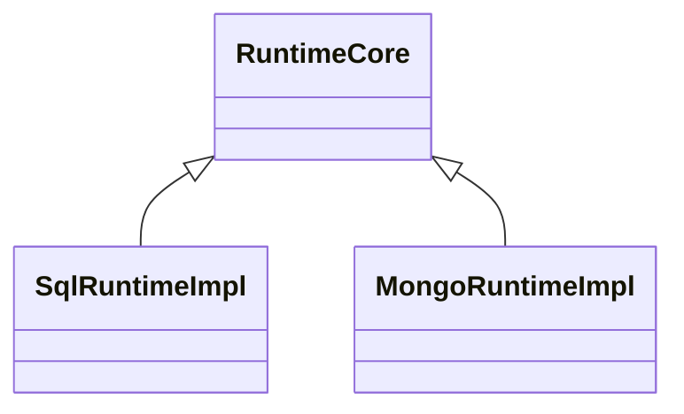

# ADR — Runtime target-layer class

Status: **Draft** (workspace ADR; promoted to `docs/architecture docs/adrs/` at project close-out).

Related: [TML-2459 — Target-extensible IR](../../target-extensible-ir/spec.md) (same three-layer pattern applied to IR), [ADR 005 — Thin core, fat targets](../../../docs/architecture%20docs/adrs/ADR%20005%20-%20Thin%20Core%20Fat%20Targets.md), [`no-target-branches.mdc`](../../../.cursor/rules/no-target-branches.mdc) (the rule this ADR gives a structural home), [umbrella `decisions.md` C12](../../supabase-integration/decisions.md), this project's [`spec.md`](../spec.md).

## Context

The runtime layer is class-based but only two of the three layers are populated today:



- `RuntimeCore<TQueryPlan, TExecPlan, TMiddleware>` — framework-components (exported).
- `SqlRuntimeImpl` — sql-runtime (NOT exported).
- `MongoRuntimeImpl` — mongo-runtime (NOT exported).

`RuntimeCore` is abstract and explicitly designed for subclassing — its `protected override lower(...)` and `protected override runDriver(...)` hooks document the contract for family-level concretions. The family-level classes (`SqlRuntimeImpl`, `MongoRuntimeImpl`) implement those hooks and extend the protected surface for their family's middleware lifecycle.

What's missing is the **target layer**. The Postgres extension uses `createRuntime(...)` directly — a factory that constructs a `SqlRuntimeImpl` and returns it as a `Runtime` interface. There is no `PostgresRuntime` class. Target-specific runtime behaviour today either lives in the SQL family layer (with `if (target === 'postgres')` branches, which we explicitly disallow per the [`no-target-branches`](../../../.cursor/rules/no-target-branches.mdc) rule) or in middleware (which is the right place for cross-cutting concerns, but not for foundational target capabilities like `LISTEN`/`NOTIFY` or `COPY`).

The Supabase integration project is the first concrete case where a downstream package needs to extend the runtime with target-locked behaviour:

- `SET LOCAL role = '...'` + `SET LOCAL request.jwt.claims = '...'` issued on every role-bound execute.
- Always-in-a-transaction guarantee (`SET LOCAL` requires it; pool reuse demands it).
- These behaviours **must not** be configurable away by user middleware — they're load-bearing for RLS enforcement (see [umbrella `decisions.md` C12](../../supabase-integration/decisions.md), [`extension-supabase` spec](../../extension-supabase/spec.md) §"Runtime architecture").

Three options were considered:

- **(a) Composition / decorator.** `SupabaseRuntime` holds a base `Runtime` and forwards every method, overriding `execute()` and `transaction()` to wrap with `SET LOCAL`. Same observable behaviour. Cost: every new method on the base runtime requires an explicit forwarder on the decorator; the decorator IS-NOT-A `PostgresRuntime`, only LOOKS-LIKE-A.
- **(b) Make Supabase extend `SqlRuntime` directly.** Export `SqlRuntimeImpl` as `SqlRuntime`; Supabase subclasses it. Skips the Postgres layer entirely. Postgres-specific behaviour added later wouldn't transparently flow into Supabase — would have to be added either to `SqlRuntime` (wrong layer) or to a future `PostgresRuntime` (which would then require Supabase to be re-rebased anyway).
- **(c) Introduce `PostgresRuntime`, Supabase extends it.** Fills the missing target layer. `SupabaseRuntime IS-A PostgresRuntime IS-A SqlRuntime IS-A RuntimeCore`. Future Postgres-specific runtime behaviour lands on `PostgresRuntime` and flows into Supabase by inheritance.

## Decision

**Adopt option (c). Introduce the runtime target-layer class as part of the Supabase integration project.**

Specifically:

1. **Rename `SqlRuntimeImpl` → `SqlRuntime`** in `packages/2-sql/5-runtime/src/sql-runtime.ts` and export it. The existing `protected override` hooks (`lower`, `runDriver`, plus the family-extended middleware lifecycle) were already designed for subclassing — only the export was missing.
2. **Add `class PostgresRuntime extends SqlRuntime`** in the Postgres extension package. Initially identity-like — its purpose is to exist as the target-layer extension point so future Postgres-specific runtime behaviour has a structural home. The `postgres()` factory constructs a `PostgresRuntime` instead of going to `createRuntime`.
3. **Add `class SupabaseRuntime extends PostgresRuntime`** in `@prisma-next/extension-supabase/runtime`. Overrides `execute()` (and `transaction()` for the multi-statement case) to wrap operations in `BEGIN; SET LOCAL role = '...'; SET LOCAL request.jwt.claims = '...'; <query>; COMMIT;`. `SET LOCAL` is issued against the raw `RuntimeConnection` returned by the base runtime — below the user-middleware chain entirely.
4. **`createRuntime` factory stays** as the unsubclassed entry point. Apps that don't need subclassing keep calling it; nothing changes for them.

This mirrors TML-2459's three-layer IR pattern at the runtime layer:

| Layer | IR (TML-2459) | Runtime (after this ADR) |
|---|---|---|
| Framework | `SchemaNodeBase` (abstract) | `RuntimeCore` (abstract) |
| Family | `SqlNode` / `MongoSchemaNode` (abstract) | `SqlRuntime` / `MongoRuntime` (concrete, extendable) |
| Target | `PostgresTable` / `SqliteTable` (concrete) | `PostgresRuntime` / `SupabaseRuntime` (concrete) |

The pattern is the same recipe at a different concern; the framework already followed it in IR, now closes the gap on runtime.

## Rationale

### Why composition (option a) was rejected

The decorator pattern's appeal is "no framework refactor needed." That appeal evaporates against the actual cost surface:

- **The decorator IS-NOT-A `Runtime`** in any sound type-theoretic sense; it only structurally implements the `Runtime` interface. New methods added to `RuntimeCore` (or `SqlRuntime`) require explicit forwarders on the decorator. A future framework PR that grows the runtime surface silently breaks decoration unless the decorator's maintainer updates.
- **`SupabaseRuntime` genuinely IS-A `PostgresRuntime`.** Supabase is Postgres with a particular runtime binding. The composition framing conflicts with the domain semantics; the subclass framing matches them.
- **The "no framework refactor" argument is small.** The refactor is ~50 LOC — one rename, one export, one near-empty subclass, one factory line. The framework's hot path is untouched (the rename is mechanical; the export adds no new code path). The risk surface is bounded by the already-explicit `protected override` hooks.

### Why skipping the Postgres layer (option b) was rejected

`SupabaseRuntime extends SqlRuntime` works for v0.1 and would be slightly less code today. The cost surfaces later:

- **The first Postgres-specific runtime behaviour** (most likely candidates: prepared-statement caching, `LISTEN`/`NOTIFY`, `COPY`-based bulk load) has nowhere to live except `SqlRuntime` (wrong layer — SQLite doesn't have `LISTEN`) or `SupabaseRuntime` (wrong specialization — non-Supabase Postgres users would miss it).
- **Adding `PostgresRuntime` later** then requires re-rebasing `SupabaseRuntime` on top of it. The diff is small but cuts across the Supabase package boundary; doing it once now is cheaper than doing it twice (once for option b, once for the rebase).

The target-layer-now-or-later question reduces to "are we sure no Postgres-specific runtime behaviour will land?" The answer for v0.1 is "we don't have any in flight," but the question for the project's lifetime is the inverse. The architectural cost of "yes" is paid once; the cost of "no, defer" compounds.

### Why this isn't scope creep

The framework already follows this pattern at the IR layer (TML-2459 is the explicit version). The runtime layer was one step behind — abstract base + family layer present, target layer absent. The Supabase project is the first consumer that surfaces the gap.

Doing the refactor *with* Supabase (rather than as a separate prerequisite project) lets us validate the layering against a real use case — `SupabaseRuntime.execute()` is a non-trivial override that exercises the `protected` surface in anger. A bare `PostgresRuntime` refactor without a downstream consumer would be a less informative test.

## Implementation sketch

### `SqlRuntime` (renamed + exported)

```ts
// packages/2-sql/5-runtime/src/sql-runtime.ts
export class SqlRuntime<TContract extends Contract<SqlStorage> = Contract<SqlStorage>>
  extends RuntimeCore<SqlQueryPlan, SqlExecutionPlan, SqlMiddleware>
  implements Runtime
{
  // existing implementation; protected hooks unchanged
  protected override async lower(plan, ctx) { /* ... */ }
  protected override runDriver(exec) { /* ... */ }
  // ...
}

export function createRuntime<TContract, TTargetId>(
  options: CreateRuntimeOptions<TContract, TTargetId>,
): Runtime {
  return new SqlRuntime({ /* ... */ });
}
```

### `PostgresRuntime` (new target-layer class)

```ts
// packages/3-extensions/postgres/src/runtime/postgres-runtime.ts
import { SqlRuntime } from '@prisma-next/sql-runtime';

export class PostgresRuntime<TContract extends Contract<SqlStorage> = Contract<SqlStorage>>
  extends SqlRuntime<TContract>
{
  // Initially empty. Exists as the target-layer extension point.
  //
  // Future Postgres-specific runtime behaviour lands here:
  //   - prepared-statement caching keyed by SqlExecutionPlan content hash
  //   - LISTEN / NOTIFY surface for change-data-capture extensions
  //   - COPY-based bulk insert path
  //   - statement_timeout / lock_timeout configuration helpers
}
```

The `postgres()` factory constructs `new PostgresRuntime(...)` instead of `createRuntime(...)`.

### `SupabaseRuntime` (new subclass in extension package)

```ts
// packages/3-extensions/supabase/src/runtime/supabase-runtime.ts
import { PostgresRuntime } from '@prisma-next/postgres/runtime';

interface RoleBinding {
  readonly role: 'authenticated' | 'anon' | 'service_role';
  readonly jwtClaims?: Record<string, unknown>;
}

export class SupabaseRuntime<TContract, TTypeMaps> extends PostgresRuntime<TContract> {
  // Per-role-bound-Db instance carries a fixed binding.
  constructor(
    private readonly binding: RoleBinding | null,  // null on the un-bound runtime
    options: PostgresRuntimeOptions<TContract>,
  ) {
    super(options);
  }

  /**
   * Override: wrap every execute in BEGIN; SET LOCAL; …; COMMIT.
   * SET LOCAL is issued against the raw connection — below the user-middleware chain.
   */
  override async *execute<Row>(plan: SqlQueryPlan, options?: RuntimeExecuteOptions) {
    if (!this.binding) {
      // Un-bound runtime cannot execute — must call asUser/asAnon/asServiceRole first.
      throw new MissingRoleBindingError();
    }
    const connection = await this.connection();
    try {
      const tx = await connection.transaction();
      try {
        await this.issueSetLocal(tx);  // raw SQL on the transaction's queryable
        yield* super.execute(plan, options);  // delegates to the base runtime — middleware sees only this
        await tx.commit();
      } catch (err) {
        await tx.rollback();
        throw err;
      }
    } finally {
      await connection.release();
    }
  }

  private async issueSetLocal(tx: RuntimeTransaction): Promise<void> {
    await tx.exec(`SET LOCAL role = ${quoteLiteral(this.binding!.role)}`);
    if (this.binding!.jwtClaims) {
      await tx.exec(`SET LOCAL request.jwt.claims = ${quoteLiteral(JSON.stringify(this.binding!.jwtClaims))}`);
    }
  }
}
```

The exact wiring of `super.execute(plan, options)` against the open `tx` (rather than against the runtime's own connection acquisition path) is the one implementation detail that surfaces real plumbing work — the base runtime's `execute` currently acquires its own connection. Two viable approaches:

- **Pass the open transaction down explicitly.** Add a `protected executeAgainstQueryable(plan, queryable, options)` hook on `SqlRuntime` (factoring the existing `executeAgainstQueryable` private into a protected hook). `SupabaseRuntime.execute()` opens its own tx and calls `super.executeAgainstQueryable(plan, tx, options)`.
- **Use a thread-local-style context** on the runtime instance. More invasive; rejected.

The first approach is the cleanest; the protected-hook lift is small and is itself a small architectural improvement (it formalises a seam that today lives as a private method).

### `RoleBoundDb` plumbing

`db.asUser(jwt)` returns a `RoleBoundDb` that internally constructs a `SupabaseRuntime` with the appropriate `RoleBinding`. The role-bound runtime shares the connection pool with the un-bound runtime (the binding is per-instance, the pool is shared) — `asUser` is therefore cheap (no IO, no construction beyond binding allocation).

## Consequences

### Positive

- **`SupabaseRuntime` transparently inherits everything `PostgresRuntime` does.** Today that's almost nothing; the value compounds when Postgres-specific runtime behaviour starts landing.
- **The [`no-target-branches`](../../../.cursor/rules/no-target-branches.mdc) rule gets a structural home for runtime code.** Today, hypothetical Postgres-specific runtime code would have nowhere to live except branches on `target.id`; this ADR fills the gap.
- **`SET LOCAL` is non-bypassable by user middleware.** The override happens below the middleware chain, on the raw `RuntimeConnection`. A user cannot misconfigure away their RLS enforcement.
- **The runtime layer now matches the IR layer (TML-2459).** Three-layer pattern is consistent across the framework's two structural axes.
- **Composition's "wrap-and-forward" boilerplate is avoided.** Future framework PRs that grow `Runtime` propagate to subclasses by inheritance, not by manual decorator updates.

### Negative

- **One framework-side refactor lands inside the Supabase project's scope.** This is a deliberate trade — paying it now is cheaper than carrying composition tech debt — but it does widen Supabase's surface beyond Supabase-only changes.
- **`SqlRuntime` becomes a public extension point.** Other extensions can now subclass it directly (rather than going via the family-target layer). This is mostly a positive but creates a small footgun — extension authors might subclass `SqlRuntime` when they should subclass their target's runtime class. Mitigation: the extension-authoring skill (tracked in [TML-2492](https://linear.app/prisma-company/issue/TML-2492/skill-author-a-prisma-next-extension)) documents the layer choice.
- **`createRuntime` is no longer the universal entry point.** It remains valid for un-extended use, but the extension story documents `new PostgresRuntime(...)` / `new SupabaseRuntime(...)` as the subclass entry. Two entry points where there was one — manageable, but worth flagging.

### Neutral

- **No observable change for users of the existing `postgres()` factory.** The factory's signature and behaviour are unchanged; only its internal construction switches from `createRuntime` to `new PostgresRuntime`.

## Future evolution

The pattern this ADR establishes is reusable for:

- **MongoDB target-layer runtime.** `class MongoDBRuntime extends MongoRuntime` (analogous to `PostgresRuntime extends SqlRuntime`), enabling Atlas-specific or community-Mongo-specific overrides without family-level branching.
- **SQLite target-layer runtime.** `class SqliteRuntime extends SqlRuntime`, enabling extensions like LiteFS or D1-specific behaviours.

These are not v0.1 work — they're documented here so the next contributor reaches for this pattern instead of inventing a new one.
