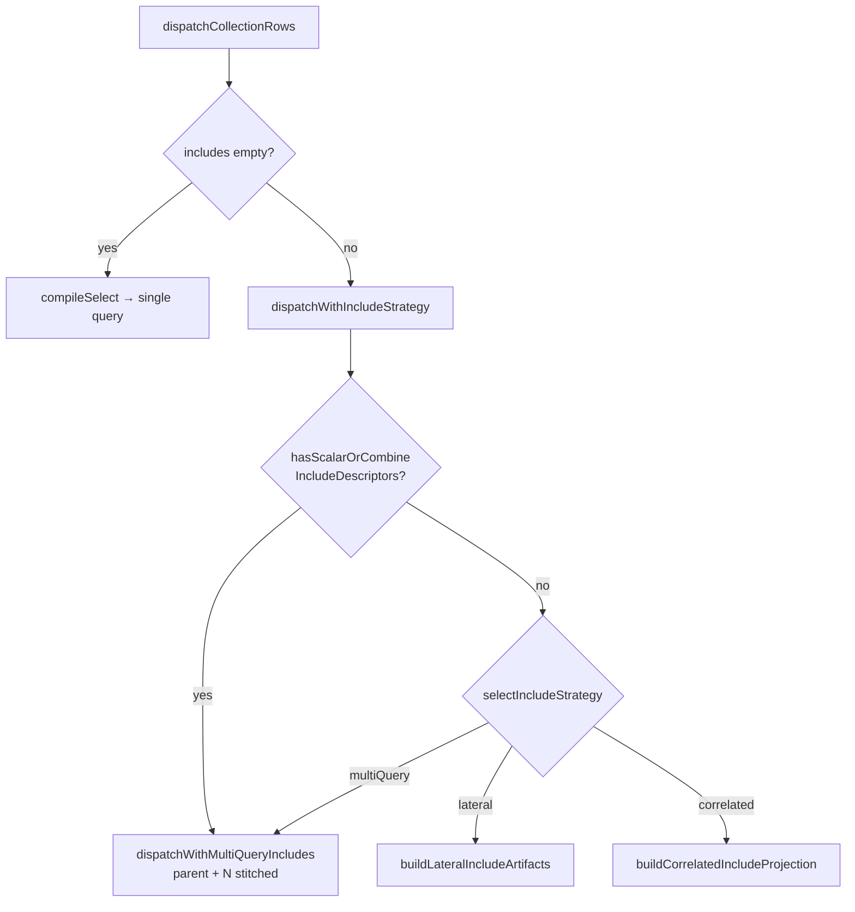
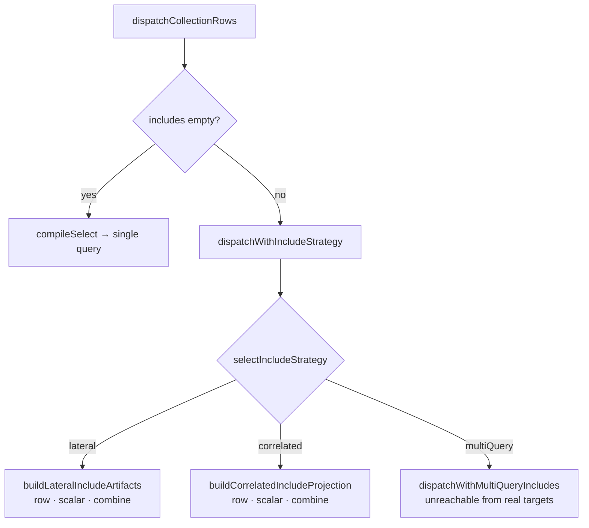

# Slice: SQL ORM single-query include aggregates

_Single-slice project: the project boundary and the slice boundary coincide. One PR closes TML-2595 and TML-2588. The downstream dead-code deletion (TML-2657) is a separate PR, tracked under its own ticket. (TML-2498 was initially in scope but reversed mid-slice and closed as not-a-bug; see [`design-decisions.md`](./design-decisions.md) for the trail.)_

## At a glance

Lower include-scalar reducers (`count` / `sum` / `avg` / `min` / `max`) and `combine()` branches into the active single-query strategy (LATERAL on Postgres, correlated subquery on SQLite + future jsonAgg-only targets) instead of falling back to the multi-query stitcher. The aggregate runs over the full refine state — `where`, `take`, `skip`, `orderBy`, `distinct` all compose through to the scalar scope, matching the natural pipeline semantic users derive from method-chaining.

After this slice, the only remaining caller of `dispatchWithMultiQueryIncludes` for in-tree targets is the synthetic test fixture; removing the path itself is TML-2657.

## Scope

### In scope

- `packages/3-extensions/sql-orm-client/src/query-plan-select.ts`
  - Extend `buildLateralIncludeArtifacts` to emit scalar branches (LATERAL with `COUNT(*)` / `SUM(col)` / `AVG(col)` / `MIN(col)` / `MAX(col)` instead of `json_agg`).
  - Extend `buildCorrelatedIncludeProjection` symmetrically (correlated subquery returning the aggregate scalar).
  - Extend both builders to handle `combine()`: multiple branches under one relation key, packed into a single `json_build_object` projection (or `json_object` on SQLite). Row-shaped and scalar-shaped branches coexist in one projection.
  - Remove the top-level `hasScalarOrCombineIncludeDescriptors` rejection at the entry to `compileSelectWithIncludeStrategy`.
- `packages/3-extensions/sql-orm-client/src/collection-dispatch.ts`
  - Remove the `hasScalarOrCombineIncludeDescriptors` dispatch gate from `dispatchWithIncludeStrategy` (the multi-query branch above the `switch`).
  - Remove the defensive `throw` in `decodeIncludePayload` that rejects nested scalar/combine descriptors. The recursive decoder must now traverse them and pull the aggregate value or the combine sub-object out of the parent row payload.
- `packages/3-extensions/sql-orm-client/src/include-tree-predicates.ts`
  - Delete the file. Its sole consumer disappears with the two removals above (verified via repo grep; no other in-tree references).
- Decoder side: `decodeIncludePayload` (and any shared helpers) handle the new payload shapes:
  - Scalar branch → primitive value at the relation key.
  - `combine` → object keyed by branch name; each branch is either an array (row-shaped) or a primitive (scalar-shaped).
  - Numeric reducers preserve the same wire shape the codec layer expects for the column's declared type (bigint stays bigint, decimal stays decimal — no JS-side coercion).
- Tests:
  - Unit: `test/query-plan-select.test.ts` — drop the planner-rejection cases; add cases asserting SQL shape for `count`, `sum`, `avg`, `min`, `max`, and a representative `combine({ rows, scalar })` mix, in both lateral and correlated modes.
  - Unit: `test/collection-dispatch.test.ts` — drop the dispatch-gate cases that asserted the fallback to multi-query for scalar/combine; replace with cases asserting single-execution dispatch for the same shapes.
  - Integration: `test/integration/*.test.ts` (Postgres via PGlite, SQLite via better-sqlite3 in-memory) — add coverage for the four-ticket acceptance shapes (see § Slice Definition of Done).

### Out of scope (this slice)

- Removing `dispatchWithMultiQueryIncludes`, the stitcher helpers, `compileRelationSelect`, or the `'multiQuery'` arm of `selectIncludeStrategy`. → TML-2657 (separate PR, blocked-by becomes "this slice merges").
- Removing the synthetic `jsonAgg`-less test contracts that exercise the multi-query fixture. → TML-2657.
- Narrowing the `IncludeStrategy` type from `'lateral' | 'correlated' | 'multiQuery'` to `'lateral' | 'correlated'`. → TML-2657.
- Dropping LATERAL in favour of correlated-everywhere on Postgres. → Tracked separately; gated on benchmark + query-plan analysis (see TML-2657 § Related).
- Mutation-path multi-query orchestration (ADR 164 territory). Untouched.
- The where-only `RelationScope` type for refine callbacks (TML-2499) — that's a type-level guard, independent of the SQL emission change here.

## Approach

The dispatch path today (post-#555, post-#576) looks like:



After this slice, the gate at `E` is gone and the two single-query builders (`H` and `I`) handle the scalar + combine shapes too. The `multiQuery` arm at `G` and the `F` branch sit unreachable from any real-target contract — that's the state TML-2657 will clean up.



### Emission shapes (illustrative — exact SQL determined during implementation)

**Lateral, scalar branch** — `include('posts', p => p.where({ published: true }).count())` against `users`:

```sql
SELECT
  users.*,
  posts_count.value AS posts
FROM users
LEFT JOIN LATERAL (
  SELECT COUNT(*) AS value
  FROM posts
  WHERE posts.user_id = users.id AND posts.published = true
) AS posts_count ON TRUE
```

Any `take` / `skip` / `orderBy` / `distinct` from the refine state composes into the scalar inner SELECT — `r.where(W).take(10).count()` returns a count of up to 10 (the rows the chain selects), matching the natural compositional semantic. For an unpaginated count, the user drops `take`; for both paginated rows + total, the user uses `combine({ page: r.take(10), total: r.count() })`.

**Correlated, scalar branch** — same query, jsonAgg-only target:

```sql
SELECT
  users.*,
  (SELECT COUNT(*) FROM posts
   WHERE posts.user_id = users.id AND posts.published = true) AS posts
FROM users
```

**Lateral, `combine({ recent, count })` branch**:

```sql
SELECT
  users.*,
  posts_combined.value AS posts
FROM users
LEFT JOIN LATERAL (
  SELECT json_build_object(
    'recent', (
      SELECT json_agg(json_build_object('id', p.id, 'title', p.title)
                      ORDER BY p.created_at DESC)
      FROM (SELECT * FROM posts WHERE posts.user_id = users.id
            ORDER BY posts.created_at DESC LIMIT 3) p
    ),
    'count', (SELECT COUNT(*) FROM posts WHERE posts.user_id = users.id)
  ) AS value
) AS posts_combined ON TRUE
```

The row branch carries its own `LIMIT 3` (the user's `take(3)`); the scalar branch ignores it. The two branches share the same outer relation reference but each scope the relation independently.

### Decoder shape

`decodeIncludePayload` today walks the include tree and pulls row arrays out of the parent payload. After this slice, the same recursion handles:

- `include.scalar !== undefined` → leaf: pull the primitive value, pass through the codec layer for the column's declared type.
- `include.combine !== undefined` → object: pull the sub-object, recurse into each branch by its key (each branch carries its own `IncludeExpr` with either `scalar` or row-shape).
- Existing row-shape path: unchanged.

The defensive throw in the decoder goes away — the recursion now handles the cases it used to reject.

## Edge cases (Example-Mapping)

| Edge case | Disposition | Notes |
|---|---|---|
| `include('rel', r => r.count())` — bare count, no refinement | Handle | Aggregate over unfiltered relation, scoped by FK. Lateral + correlated. |
| `include('rel', r => r.where(W).count())` — count with where | Handle | Aggregate over where-filtered relation. Lateral + correlated. |
| `include('rel', r => r.where(W).take(N).count())` — pagination composes through | Handle | LIMIT and OFFSET ENTER the COUNT scope. The aggregate runs over the refine's full state, so the count is over the paginated row-set (returns ≤ N). Matches the natural pipeline semantic; users wanting the unpaginated total drop `take`. Test asserts this explicitly. |
| `include('rel', r => r.where(W).skip(N).count())` — skip case | Handle | Same — OFFSET enters COUNT scope. |
| `include('rel', r => r.sum('field'))` / `avg` / `min` / `max` | Handle | Same shape as count; aggregate function differs. One test per reducer in each strategy. |
| `include('rel', r => r.combine({ rows: r.take(N), count: r.count() }))` — TML-2595 worked example | Handle | Single query, two branches packed into one `json_build_object`. The Pothos `totalCount` shape. |
| `include('rel', r => r.combine({ a: r.count(), b: r.sum('field') }))` — multiple scalar branches | Handle | All branches resolve in one query. |
| `include('rel', r => r.combine({ a: r.where(W1).count(), b: r.where(W2).count() }))` — divergent where per branch | Handle | Each branch independently scoped. |
| Numeric `sum` / `avg` on `bigint` / decimal / large-`number` columns | Handle | Aggregate happens in SQL — numeric semantics match the database, not JS. Codec layer decodes the scalar via the column's declared codec. Test asserts no JS-side `Number` coercion truncation. |
| `sum` / `avg` / `min` / `max` over empty relation | Handle | Database returns NULL; codec decodes to TypeScript null. Public surface preserves whatever shape today's JS-side reducer returns (`null` for `sum`/`avg`/`min`/`max`; `0` for `count`). Verify symmetry with existing tests; if today's shape was wrong, fix it and note in PR description. |
| Nested include with scalar at any depth (e.g. `user.include('posts', p => p.include('comments', c => c.count()))`) | Handle | The recursive scan that gated this at any depth is gone; nested builders recurse naturally. Lateral + correlated. |
| `combine` containing a row branch with `distinct(cols)` — interplay with TML-2656 lowering | Handle | The ROW_NUMBER lowering inside the row branch is unchanged; the scalar branch sees the full unfiltered relation as usual. Test covers. |
| Parent model is polymorphic (STI or MTI); scalar reducer on a non-polymorphic relation | Handle | MTI joins for the parent already live in the outer SELECT via `buildMtiJoins` in `compileSelectWithIncludeStrategy`; the LATERAL/correlated subquery references those columns transparently. Polymorphic post-decode mapping runs on the parent row and is irrelevant on the scalar branch (which returns a primitive). Works for free; no slice-specific code needed. |
| **Included relation's target model is polymorphic** (STI or MTI) — scalar reducer, row include, or `combine` | Explicitly out | **Pre-existing gap, not specific to this slice.** Investigation during design discussion confirmed: the child SELECT family (`buildIncludeChildRowsSelect` and friends) does not invoke `buildMtiJoins` for the related model, and `decodeIncludePayload` calls only the non-polymorphic `mapStorageRowToModelFields`. STI-target includes silently return base-shaped rows with no variant discrimination; MTI-target includes silently lose all variant-specific columns. No integration test exercises polymorphic-target includes. Tracked separately in [TML-2683](https://linear.app/prisma-company/issue/TML-2683) (blocked by TML-2657). This slice neither widens nor narrows the gap. |
| Target without `jsonAgg` capability | Defer | Falls back to `dispatchWithMultiQueryIncludes` via the `default` arm of the strategy switch. The dispatch gate going away doesn't affect this — the `multiQuery` strategy still routes there. TML-2657 removes this arm entirely later. |
| `include().count()` with `orderBy` on the refine | Handle | `orderBy` is meaningless for a scalar aggregate; planner ignores it. Test asserts no SQL emitted for the ORDER BY in the scalar branch. (Could also be runtime-warned, but silent ignore matches existing behaviour for other irrelevant clauses.) |
| Aliased include (TML-2598) interaction | Explicitly out | TML-2598 is a separate, not-yet-shipped feature. If it lands first, this slice extends; if after, TML-2598 extends. Not coupled. |

## Slice Definition of Done

- [ ] **SDoD1.** All "Done when" gates from the slice plan pass (CI green; `pnpm lint:deps` clean; `pnpm typecheck` clean; `pnpm test:packages` clean; `pnpm test:integration` clean across PGlite + memory SQLite).
- [ ] **SDoD2.** Every pre-named edge case handled per its disposition. Each "Handle" row has at least one corresponding test (unit or integration).
- [ ] **SDoD3.** Acceptance criteria from all three Linear tickets satisfied:
  - **TML-2595.** `include('posts', p => p.combine({ recent: p.take(3), count: p.count() }))` resolves in 1 SQL execution on a Postgres-capability test contract; same in 1 execution on a SQLite-capability contract via correlated subqueries. `include('posts', p => p.count())` resolves in 1 SQL execution on capable targets.
  - **TML-2588.** Public API `count() / sum() / avg() / min() / max()` semantics on `include(...)` refinements compile to SQL aggregates (verified by inspecting `compileSelect*` output in unit tests + counting executions in integration tests). No O(N) child-row materialization in process for the default path.
- [ ] **SDoD4.** Manual-QA: **explicit N/A.** Rationale: the slice changes only how the SQL ORM emits queries and decodes their results. The public API surface (method names, return shapes, types) is unchanged. Correctness of emitted SQL and result decoding is covered exhaustively by unit tests (planner shape) + integration tests (PGlite + memory SQLite). No UX surface to walk through.
- [ ] **SDoD5.** Slice doesn't touch any of: `dispatchWithMultiQueryIncludes`, the stitcher helpers, `compileRelationSelect`, the `IncludeStrategy` type, or any mutation-path code. Anti-corruption check: a `git diff --stat` against `main` shows changes only in the files listed under § Scope.
- [ ] **SDoD6.** PR description references both closed Linear tickets (TML-2595, TML-2588), states that TML-2657 is the deletion follow-up, notes TML-2498's mid-slice reversal (closed as not-a-bug), and includes the SQL-shape illustrative snippets above (or equivalent) so reviewers don't have to derive the new query shapes themselves.

## Open Questions

1. _(resolved — mid-slice)_ **TML-2498 urgency re-check.** Working position at spec-write time was "latent footgun." Reversed during PR self-review: the TML-2498 framing was a misreading; the page-capped count is the natural compositional semantic, not a bug. Ticket closed as not-a-bug by the PR author. See [`design-decisions.md`](./design-decisions.md) D1.

2. **NULL/empty-relation return shape for `sum` / `avg` / `min` / `max`.** Working position: match the JS-side reducer's current return shape (`null` for empty; `0` for `count`). Confirm against today's tests during implementation. If the JS reducer was returning something wrong (e.g. `NaN` from `0/0` on `avg`), the SQL emission is a chance to fix it — flag in PR description, don't sneak it in.

3. **`combine` SQL shape: one LATERAL with one `json_build_object` projection containing N branches, vs. N LATERALs each contributing one key.** Working position: one LATERAL per combine (so each top-level relation key is one join), with `json_build_object` packing N branches inside. Cleaner planner output, fewer joins, easier for Postgres to flatten. Validate during dispatch 1 (lateral builder); if shape proves awkward for the row+scalar mix, escalate via design-discussion.

4. **Resist the LATERAL-vs-correlated scope creep.** While both builders are open on the bench, the temptation to measure & collapse will surface. Working position: do NOT yield. The benchmark question is gated on dedicated query-plan analysis (per TML-2657), not on whatever falls out of incidental implementation. If a load-bearing observation surfaces during the work (e.g. correlated form turns out cleaner to generate uniformly), record it in `projects/sql-orm-include-aggregates/design-decisions.md` and keep going.

## References

- **Linear tickets closed by this slice:** [TML-2595](https://linear.app/prisma-company/issue/TML-2595), [TML-2588](https://linear.app/prisma-company/issue/TML-2588).
- **Linear ticket related to but NOT closed by this slice:** [TML-2498](https://linear.app/prisma-company/issue/TML-2498) (initial in-scope target; reversed mid-slice and closed by the author as not-a-bug — see [`design-decisions.md`](./design-decisions.md) D1).
- **Follow-up ticket (separate PR):** [TML-2657 — remove multi-query include strategy from read path](https://linear.app/prisma-company/issue/TML-2657). Its acceptance criteria already enumerate the deletion + test-repurposing scope.
- **Discovery from this design-discussion (separate work, blocked by TML-2657):** [TML-2683 — `.include()` silently degrades on polymorphic target models](https://linear.app/prisma-company/issue/TML-2683). Pre-existing gap surfaced while pressure-testing the polymorphism edge case in this spec; not introduced by this slice.
- **Predecessor PRs that brought the read path to its current shape:**
  - [#555](https://github.com/prisma/prisma-next/pull/555) (TML-2594) — depth-2+ nested includes via single-query.
  - [#576](https://github.com/prisma/prisma-next/pull/576) (TML-2656) — `.distinct(cols)` lowering via ROW_NUMBER.
- **Architectural context:**
  - [ADR 164 — Repository Layer](../../docs/architecture%20docs/adrs/ADR%20164%20-%20Repository%20Layer.md). Mutation-path multi-query orchestration; untouched by this slice but informs why we're not deleting `acquireRuntimeScope` / `transaction()` / `connection()`.
- **Design-discussion summary that produced this slice:** held inline in the conversation surface; key decisions persisted in this spec's § Open Questions and § Approach. If the slice surfaces a falsified assumption mid-flight, amend via `drive-discussion` per invariant I12 and log to `projects/sql-orm-include-aggregates/design-decisions.md`.
