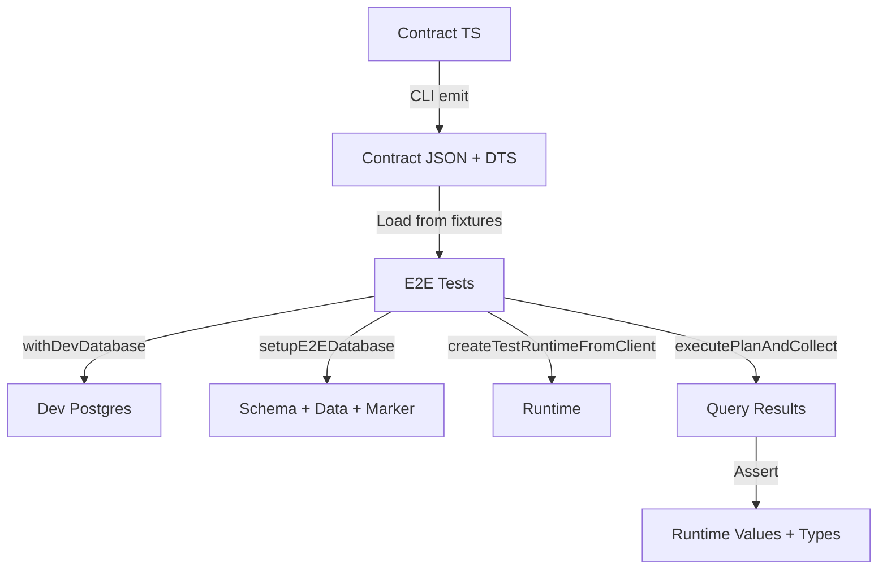

# @prisma-next/e2e-tests

End-to-end tests that verify the full flow using the built CLI, emitted contract artifacts, SQL query builders, runtime, Postgres adapter and driver.

## What this tests
- Contract emission via CLI (single test verifies emission correctness)
- Load contracts from committed fixtures (not emit on every test run)
- Spin up dev Postgres instances and stamp contract markers
- Build plans from emitted artifacts and execute via runtime
- Assert multiple rows and verify compile-time row types
- Test nested projection shaping with flattened aliases

## Location

This package is located at `test/e2e/framework/` (not in `packages/`) as it is a test suite, not a source package.

## Scripts
- `pnpm test` (from `test/e2e/framework/`) — run the test suite (requires repo build first)
- `pnpm emit` (from `test/e2e/framework/`) — regenerate committed fixture artifacts from `test/fixtures/contract.ts`

## Architecture



## Dependencies

- `@prisma-next/test-utils`: Shared test utilities (database, runtime, contract helpers)
- `@prisma-next/sql-query`: SQL query DSL and contract validation
- `@prisma-next/runtime`: Runtime execution engine
- `@prisma-next/adapter-postgres`: Postgres adapter
- `@prisma-next/driver-postgres`: Postgres driver

## Test Patterns

Tests use shared utilities from `@prisma-next/test-utils` via a wrapper file that injects dependencies:

```typescript
// Import from package-specific wrapper (injects dependencies)
import {
  withDevDatabase,
  withClient,
  loadContractFromDisk,
  setupE2EDatabase,
  createTestRuntimeFromClient,
  executePlanAndCollect,
} from './utils';  // Wrapper around @prisma-next/test-utils

// Load contract from committed fixtures (not emit on every test)
const contract = await loadContractFromDisk<Contract>(contractJsonPath);

await withDevDatabase(
  async ({ connectionString }) => {
    await withClient(connectionString, async (client) => {
      await setupE2EDatabase(client, contract, async (c) => {
        // Test-specific schema/data setup
      });

      const adapter = createPostgresAdapter();
      const runtime = createTestRuntimeFromClient(contract, client, adapter);
      try {
        const plan = sql({ contract, adapter }).from(tables.user).select({ ... }).build();
        const rows = await executePlanAndCollect(runtime, plan);
        // Assertions
      } finally {
        await runtime.close();
      }
    });
  },
);
```

## Contract Loading Strategy

- **Load from fixtures**: Tests load contracts from `test/fixtures/generated/contract.json` (committed artifacts)
- **Single emission test**: One test (`emitAndVerifyContract`) verifies that contract emission produces expected artifacts
- **Benefits**: Faster test execution, stable contract artifacts, reduced duplication

## Notes
- Build the repo first: `pnpm -w build`
- Uses unique ports for the dev DB to avoid conflicts (54020-54112 range)
- Type tests import the committed `test/fixtures/generated/contract.d.ts`
- Tests use shared utilities from `@prisma-next/test-utils` via `test/utils.ts` wrapper (injects dependencies)
- The `executePlanAndCollect` function properly infers return types using `ResultType<P>` from `@prisma-next/sql-query/types`

## Test Utilities

Contract-related test utilities are located in `test/e2e/framework/test/utils.ts`. These utilities depend on `@prisma-next/sql-contract-ts` and `@prisma-next/sql-contract` for contract validation and types.

**Available Utilities:**
- `loadContractFromDisk<TContract>(contractJsonPath)`: Loads an already-emitted contract from disk. The generic type parameter should be specified from the emitted `contract.d.ts` file (e.g., `loadContractFromDisk<Contract>(contractJsonPath)`).
- `emitAndVerifyContract(cliPath, contractTsPath, adapterPath, outputDir, expectedContractJsonPath)`: Emits contract via CLI and verifies it matches on-disk artifacts. Used in a single test to verify contract emission correctness.

**Usage:**
```typescript
import { loadContractFromDisk, emitAndVerifyContract } from './utils';
import type { Contract } from './fixtures/generated/contract.d';

// Load contract from committed fixtures
const contract = await loadContractFromDisk<Contract>(contractJsonPath);

// Emit and verify contract
await emitAndVerifyContract(cliPath, contractTsPath, adapterPath, outputDir, expectedContractJsonPath);
```

**Note**: These utilities are local to the e2e-tests package and depend on `@prisma-next/sql-lane` and `@prisma-next/sql-contract`. They are not exported from `@prisma-next/test-utils` to avoid circular dependencies.

