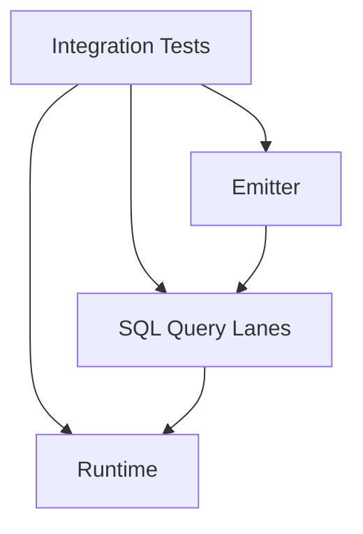

# @prisma-next/integration-tests

Integration tests for Prisma Next that verify end-to-end behavior across packages.

## Overview

This package contains integration tests that verify the complete flow from contract emission through query building and execution. It tests real consumer behavior by using only public package exports.

## Purpose

- Verify end-to-end flows across packages (emitter → lanes → runtime)
- Test real consumer behavior (no deep imports)
- Ensure package boundaries remain intact
- Validate that emitted contracts work correctly with lanes and runtime

## Structure

- `test/*.test.ts` - Integration test files
- `test/*.e2e.test.ts` - CLI integration tests (run commands in-process, not subprocess)
- `test/*.test-d.ts` - Type-only test files (for testing TypeScript types)
- `test/*.helpers.ts` - Shared test helpers for related test files
- `test/fixtures/` - Test fixtures (contract JSON, type definitions, CLI fixture apps)

**Note**: Integration tests that depend on multiple packages (e.g., both `sql-contract-ts` and `sql-query`) are placed here to avoid cyclic dependencies.

### Test File Organization

Large test files (exceeding 500 lines) should be split into smaller, focused files:

- Use descriptive suffixes: `*.basic.test.ts`, `*.errors.test.ts`, `*.types.test.ts`, `*.modes.test.ts`
- Extract shared setup into a `*.helpers.ts` file (e.g., `family.schema-verify.helpers.ts`)
- Each test file should be independently runnable

Example: `family.schema-verify.test.ts` was split into:
- `family.schema-verify.basic.test.ts` - Happy path, missing table/column tests
- `family.schema-verify.constraints.test.ts` - Primary key, foreign key tests
- `family.schema-verify.types.test.ts` - Type mismatch, nullability tests
- `family.schema-verify.modes.test.ts` - Strict/permissive mode tests
- `family.schema-verify.helpers.ts` - Shared setup and helper functions

## CLI Integration Tests

The `*.e2e.test.ts` files in this directory are **in-process CLI tests** that:
- Import command factories directly (e.g., `createDbInitCommand()`)
- Mock `process.exit` and `console.log` to capture output
- Run commands via `command.parseAsync()` in the same Node process

**Note**: These are named "e2e" for historical reasons but are really integration tests. True subprocess E2E tests (which spawn the CLI as a separate process) should use the pattern in `cli.emit-cli-process.e2e.test.ts` and ideally live in `test/e2e/framework/`.

## Dependencies

This package depends on all packages under test via workspace protocol:
- `@prisma-next/adapter-postgres` - Postgres adapter
- `@prisma-next/cli` - CLI for contract emission
- `@prisma-next/contract` - Contract types
- `@prisma-next/driver-postgres` - Postgres driver
- `@prisma-next/emitter` - Contract emission
- `@prisma-next/runtime` - Execution runtime
- `@prisma-next/sql-contract-ts` - SQL contract authoring (for integration tests)
- `@prisma-next/sql-query` - Query builders (legacy; prefer `@prisma-next/sql-lane` and `@prisma-next/sql-relational-core`)
- `@prisma-next/sql-contract` - SQL contract types (canonical source: `@prisma-next/sql-contract/types`)

## Location

This package is located at `test/integration/` (not in `packages/`) as it is a test suite, not a source package.

## Running Tests

```bash
# Run all integration tests (from test/integration/)
cd test/integration && pnpm test
```

Tests automatically depend on builds of target packages via Turborepo.

## Test Strategy

- **No circular dependencies**: Tests import from built packages only
- **Public API only**: Tests use only public exports (respect package.json exports)
- **Real consumer behavior**: Tests simulate how real consumers would use the packages
- **End-to-end flows**: Tests verify complete flows (emit → lanes → runtime)

## Related Packages

- `@prisma-next/sql-query`: SQL query builder and plan types
- `@prisma-next/runtime`: Runtime execution engine that consumes contracts
- `test/e2e/framework/`: End-to-end tests using the CLI to emit contracts and execute queries

## Architecture


